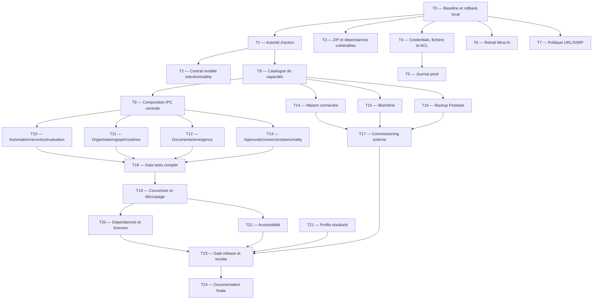

# Mina Vision — Exhaustive Reconciliation Implementation Plan

> **For agentic workers:** REQUIRED SUB-SKILL: Use superpowers:executing-plans to implement this plan task-by-task.

**Goal:** réconcilier le produit Mina Vision réellement exécutable avec ses contrats V2, V3 et V4, supprimer les écarts de sécurité et de vérité produit observés le 22 juillet 2026, puis produire une preuve de recette reproductible sans attribuer de version V5 inexistante.

**Architecture:** conserver Electron comme processus d’orchestration local unique, avec un modèle qui propose des actions structurées mais ne touche jamais directement aux exécuteurs. Toute capacité suit la chaîne `intention → normalisation → autorisation liée à la session et au digest → confirmation éventuelle → exécution → vérification → journal minimal`. Les domaines déjà codés mais isolés sont composés derrière des contrôleurs et IPC explicites. Un catalogue de capacités devient la source de vérité du renderer, de l’aide et du diagnostic.

**Tech Stack:** Windows 11, Node.js 22, Electron 43, JavaScript ESM, Vitest 4, Playwright, SQLite via `better-sqlite3`, Windows Sandbox, Android/Kotlin/Gradle, Firebase optionnel, LM Studio/OpenAI-compatible, Gemini, DeepSeek, OpenRouter, Modal, ADB USB/Wi-Fi, Home Assistant/MQTT.

---

## 1. Portée et décisions de cadrage

Ce plan couvre uniquement le projet local actuel :

`C:\Serveurs\Mina Vision`

Il exclut explicitement l’ancien projet `Mina AI`. Aucun fichier de cet ancien projet ne doit être lu, modifié, migré ou traité comme racine de confiance. Les références historiques `G:\Serveurs\Mina AI`, `G:\Serveurs\Mina AI\API`, `G:\Serveurs\Mina AI\APP` et `G:\Serveurs\Mina AI\Modal` présentes dans le runtime actuel sont des contaminations à retirer de Mina Vision, pas des dépendances à restaurer.

État des versions à respecter :

- V1 n’est pas un plan produit formalisé exploitable comme spécification canonique.
- V2, V3 et V4 ont des plans explicites et constituent l’historique fonctionnel à réconcilier avec le code courant.
- V5 n’existe ni comme spécification validée ni comme release démontrée. Le terme `V5` ne doit pas être introduit dans l’UI, le changelog ou le marketing avant une décision produit séparée de Nasro.
- `MINA.md` reste la constitution. Sa modification exige une proposition séparée et une validation explicite ; ce plan ne prévoit aucune modification de ce fichier.
- Les fichiers Markdown existants servent de contexte, mais le comportement du code et les preuves d’exécution priment lorsqu’ils divergent.

Ce document autorise seulement une future exécution planifiée. Sa création ne modifie aucun code, aucune configuration, aucun secret, aucune ACL et aucun système externe.

---

## 2. Baseline de l’audit en lecture seule

Les chiffres ci-dessous sont la baseline observée pendant l’audit du 22 juillet 2026. L’exécuteur doit les remesurer au début de la vague 0 et coller le stdout brut dans le journal d’exécution ; ils ne doivent jamais être réutilisés comme preuve d’un état ultérieur.

| Contrôle | Commande de baseline | Résultat observé le 22 juillet 2026 |
|---|---|---|
| Tests Node par défaut | `npm test` | 323 fichiers, 2 731 tests réussis |
| Tests d’intégration | `npm run test:integration` | 16 fichiers réussis, 1 fichier en échec ; 47 tests réussis, 1 test en échec |
| Défaut d’intégration | même commande | contrat de fixture PNG périmé alors que le worker produit volontairement du JPEG |
| Smoke Electron | `npm run smoke` | réussi |
| Smoke SQLite Electron | `npm run smoke:sqlite:electron` | réussi |
| Android JVM + lint | `android\gradlew.bat test lint` | 35 tests JVM réussis ; lint 26 avertissements, 0 erreur ; 5 `androidTest` non exécutés |
| Couverture Node | `npm run test:coverage` | lignes 89,85 %, statements 84,13 %, fonctions 81,91 %, branches 78,22 % |
| Readiness | `npm run verify` | clés cloud, Android USB et Wi-Fi prêts ; LM Studio, Google Home SDK, comptes mail et Firebase non prêts ou non configurés ; `allRequiredReady:false` |
| Recette humaine | `tests/manual/MINA-VISION-ACCEPTANCE.md` | 20 scénarios `not_run` |
| Isolation | détection Windows Sandbox et runtimes | Windows Sandbox, Python 3.14.6, Node 22.14.0 et PowerShell 7.5.5 disponibles |
| Gestion de versions | `git rev-parse --is-inside-work-tree` | aucun dépôt Git |

Couverture structurelle observée : 392 modules JavaScript sous les racines mesurées, dont 214 statiquement atteignables depuis les entrées analysées et 178 non atteignables par cette analyse statique. Ce nombre ne signifie pas que 178 modules sont morts : les chargements dynamiques et les tests peuvent les consommer. Il signifie que chaque domaine non composé doit être prouvé au runtime avant d’être présenté comme disponible.

### 2.1 Réconciliation des versions et mémoires

| Source historique | Capacités à préserver | État courant retenu pour ce plan | Réconciliation |
|---|---|---|---|
| Constitution / socle initial | identité Mina, contrôle explicite, arrêt d’urgence, confirmations, vérité et confidentialité | socle actif ; `MINA.md` volontairement inchangé | non-régression dans toutes les vagues |
| V2 — core, sessions, grounding, mémoire/recherche, skills/sandbox, Android messaging | sessions start/during/end, claims, mémoire locale, recherche sourcée, installation de skills isolée, passerelle Android | largement implémenté et testé ; risques ZIP, fichiers sensibles, SSRF et autorité d’action encore ouverts | Tasks 1–7, 18, 23 |
| V3 — providers, local models, voix, computer-use, email, Android Kotlin, smart-home, caméra/biométrie, analytics | modes auto/local-first/local-only, voice stop/pause, contrôle PC/browser/mobile, email, maison, vision, coûts | voix/caméra/providers/Android présents ; maison vide, biométrie factice, comptes externes incomplets | Tasks 2, 8, 14–19, 23 |
| V4 — automation/reliability, organisation/knowledge, documents/emergency, approvals/connectors/personality | domaines structurés, recovery, évaluations, graph/routines, documents/impression, corpus offline, extensions privées | beaucoup de modules et tests isolés existent ; composition runtime incomplète | Tasks 8–13, 18–19, 23 |
| Mise à jour docs du 22 juillet 2026 | Mina Code, génération de documents, toute app Windows, stop/pause distincts, Huawei/Samsung, mémoire auto-déverrouillée | certaines capacités sont réelles, d’autres doivent être reformulées selon le catalogue et la recette | Tasks 8, 22–24 |
| V5 | aucune spécification ou release validée trouvée | inexistante | ne pas créer ce label |

### 2.2 Périmètre de non-régression

Les vagues de correction ne doivent pas casser les capacités déjà démontrées par leurs suites existantes :

- mémoire, crypto, keyring, migrations, ranking, RAG et oubli ;
- sessions, claims, grounding, response gate et arrêt d’urgence ;
- Mina Code : indexation, AST, call graph, impact, plan, patch, backup, sandbox, boucle de tests et vérification ;
- voix locale/cloud, présence, stop, pause, scheduling et wake phrases ;
- contrôle browser/desktop/Android, curseur visible et vérification post-action ;
- Huawei/Samsung, ADB USB/Wi-Fi, SMS natif/HTTPSMS, Telegram, retry/dead-letter et failover ;
- caméra, vision, OCR, documents, formulaires, conversion et impression simulée ;
- mail, calendrier, tâches, contacts, analytics, budgets et provider routing ;
- Windows Sandbox, skills et connectors isolés.

Le gate de chaque vague sélectionne les tests impactés, puis le gate complet. Une capacité de cette liste qui régresse bloque la vague même si le nouvel écart est corrigé.

---

## 3. Définition de « réconcilié »

Une capacité n’est considérée livrée que si les six niveaux suivants sont tous prouvés :

1. **Présente** : son module et ses contrats existent.
2. **Composée** : le processus principal construit ses dépendances réelles.
3. **Exposée** : l’IPC ou le routeur de commandes l’atteint via une allowlist.
4. **Configurée** : ses prérequis locaux ou externes sont valides.
5. **Autorisée** : chaque effet passe par le broker et les règles de canal.
6. **Vérifiée** : un test d’intégration ou une recette live confirme l’effet réel.

Le catalogue de capacités doit publier exactement :

```js
{
  id: 'backup.firebase',
  status: 'available' | 'degraded' | 'unavailable',
  reason: null | 'firebase_unconfigured',
  evidence: ['unit', 'integration', 'live'],
  updatedAt: '2026-07-22T12:00:00.000Z'
}
```

Contraintes du contrat :

- `available` exige composition, configuration et preuve live ou locale applicable.
- `degraded` exige un chemin de repli réellement testé.
- `unavailable` désactive l’action correspondante dans le renderer et explique la raison.
- Le catalogue ne retourne jamais clé, token, email, transcript, chemin de coffre ou configuration secrète.
- Une suite unitaire verte sur un module isolé ne suffit jamais à produire `available`.

---

## 4. Registre exhaustif des écarts

| ID | Gravité | Écart à réconcilier | Tâche propriétaire |
|---|---:|---|---:|
| R-01 | ÉLEVÉE | `capability-broker.mjs` existe mais la boucle Computer Use exécute encore après `classifyAction()` sans grant de session ni confirmation liée au digest | 1–2 |
| R-02 | ÉLEVÉE | `adm-zip@0.5.18` vulnérable est atteignable depuis l’installation de skills et la quarantaine des pièces jointes | 3 |
| R-03 | MOYENNE | `.env`, fichiers OAuth/service-account et ACL Windows trop permissives ; les motifs `client_secret_*.json` ne sont pas couverts de façon robuste | 4 |
| R-04 | MOYENNE | le journal d’activité peut persister des transcriptions vocales en clair ; le dossier est lisible par un groupe local large | 5 |
| R-05 | MOYENNE | quatre racines de l’ancien projet Mina AI restent implicitement autorisées par la politique d’écriture hôte et ses tests | 6 |
| R-06 | MOYENNE | le lecteur Web accepte HTTP(S) sans bloquer loopback, link-local, réseaux privés, DNS rebinding et redirections vers ces réseaux | 7 |
| R-07 | MOYENNE | les IPC de nombreux domaines V4 existent mais ne sont pas enregistrés par une composition centrale protégée par sender-frame et taille | 8–9 |
| R-08 | MOYENNE | automation, recovery, evaluation, graph, routines, documents, emergency, approvals, connectors et personality sont largement testés isolément mais non tous atteignables dans le runtime principal | 10–13 |
| R-09 | MOYENNE | maison connectée initialisée avec registre/connecteurs vides ; Google Home explicitement indisponible | 14 |
| R-10 | MOYENNE | biométrie composée avec un embedder qui lève `face_embedding_pipeline_not_implemented` | 15 |
| R-11 | MOYENNE | backup/Firebase implémentés isolément mais non composés ; l’état UI se réduit à une disponibilité booléenne | 16 |
| R-12 | MOYENNE | comptes mail, LM Studio, Firebase et certaines intégrations live ne sont pas configurés ; `verify` ne peut pas servir de gate strict car il sort volontairement avec code 0 | 17, 23 |
| R-13 | MOYENNE | le test Node par défaut exclut l’intégration ; le contrat PNG/JPEG périmé rend l’intégration rouge | 18 |
| R-14 | FAIBLE/MOYENNE | couverture sans seuil ; entrées critiques `main.mjs`, renderer, workers et provider HTTPSMS peu ou pas instrumentées | 19 |
| R-15 | FAIBLE | `main.mjs` et `renderer.js` sont monolithiques, ce qui rend les domaines difficiles à composer, tester et arrêter proprement | 9, 19 |
| R-16 | FAIBLE/MOYENNE | `@google/generative-ai`, `mqtt` et `ws` ne sont pas justifiés par les imports courants de la source auditée | 20 |
| R-17 | MOYENNE conditionnelle | `espeak-ng` est GPL-3.0 alors que `package.json` déclare ISC et aucun fichier `LICENSE` n’établit clairement la politique de distribution | 20 |
| R-18 | FAIBLE | profils navigateur résiduels, données de session et ACL larges dans le dossier projet | 21 |
| R-19 | FAIBLE | récupération de phrase sans association de label explicite et CSS avec largeur minimale pouvant casser les petits écrans | 22 |
| R-20 | FAIBLE/MOYENNE | README/CHANGELOG/PRODUCT/DESIGN/help et anciens plans mélangent parfois « module présent » et « capacité disponible » ; `Pour Nasro.md` est référencé mais absent | 24 |
| R-21 | QUALITÉ | 20 recettes manuelles non exécutées et 5 tests Android instrumentés non exécutés | 23 |
| R-22 | GOUVERNANCE | aucune stratégie de rollback versionnée n’existe puisqu’il n’y a pas de dépôt Git | 0 |

Tous les écarts R-01 à R-22 ont une tâche et un critère de sortie. Aucun écart n’est clôturé par une modification documentaire seule.

---

## 5. Ordre de dépendance



Les tâches d’une même vague peuvent être exécutées en parallèle uniquement après autorisation explicite de Nasro concernant le nombre et le rôle des agents. Par défaut, l’exécution est séquentielle par un seul agent.

---

## 6. Contraintes globales d’exécution

- TDD strict : observer le test rouge, écrire le minimum, observer le vert, lancer la suite impactée, puis le gate de vague.
- Diff minimal : aucun reformatage de masse de `main.mjs`, `renderer.js` ou d’un plan historique.
- Aucun secret ne doit apparaître dans un test, une fixture, un stdout archivé ou le journal d’exécution.
- Aucun `git push`, aucun déploiement et aucun changement externe automatique.
- Aucun commit : le projet n’est pas un dépôt Git. Une future initialisation Git requiert l’accord explicite de Nasro.
- Avant chaque vague, créer une copie de sécurité hors projet dans `C:\Serveurs\Mina Vision.checkpoints\<vague>-<horodatage>` en excluant `node_modules`, `coverage`, `profiles`, `sandbox`, les bases live et `.env` ; pour les fichiers sensibles exclus, ne conserver qu’un hash SHA-256, jamais une copie supplémentaire.
- En l’absence de Git, chaque tâche se termine par la liste des fichiers modifiés, leur hash avant/après, les commandes exécutées, leur code de sortie et le stdout utile dans `docs/superpowers/execution/2026-07-22-mina-vision-reconciliation-log.md`.
- Tout changement de schéma SQLite doit être précédé d’une revue migration dédiée ; aucune migration n’est appliquée à une base live pendant les tests unitaires.
- Toute nouvelle variable d’environnement exige la lecture de `C:\Users\Nasro\.claude\skills\vercel-env-vars\SKILL.md` au moment de l’implémentation. Ce projet local ne doit pas créer de variable Vercel sans besoin réel.
- Toute assertion sur Firebase, Gmail, Google Home, LM Studio, Telegram, Android ou une imprimante exige une sonde live ; un fichier Markdown n’est pas une preuve.
- `MINA.md` n’est pas modifié.
- L’ancien projet Mina AI n’est jamais touché.

### Commande de checkpoint de vague sans Git

À exécuter depuis PowerShell avant le premier fichier modifié de chaque vague, en remplaçant seulement `vague-1` par l’identifiant réel :

```powershell
$sourceRoot = (Resolve-Path -LiteralPath 'C:\Serveurs\Mina Vision').Path
$checkpointParent = 'C:\Serveurs\Mina Vision.checkpoints'
$checkpointName = 'vague-1-' + (Get-Date -Format 'yyyyMMdd-HHmmss')
$checkpointPath = Join-Path $checkpointParent $checkpointName
if ($checkpointPath.StartsWith($sourceRoot + [IO.Path]::DirectorySeparatorChar, [StringComparison]::OrdinalIgnoreCase)) {
  throw 'checkpoint_target_inside_source'
}
New-Item -ItemType Directory -Path $checkpointPath -Force | Out-Null
robocopy.exe $sourceRoot $checkpointPath /E /COPY:DAT /DCOPY:DAT /R:1 /W:1 /XD node_modules coverage profiles sandbox .git /XF .env '*.db' '*.sqlite' '*.sqlite3'
if ($LASTEXITCODE -gt 7) { throw "checkpoint_failed:$LASTEXITCODE" }
Get-FileHash -Algorithm SHA256 -LiteralPath (Join-Path $sourceRoot '.env')
```

Attendu : `robocopy` retourne un code 0 à 7, la destination résolue reste hors source et `.env` n’est pas copié. Le hash `.env` sert uniquement à détecter une modification accidentelle. Aucun checkpoint n’est supprimé automatiquement.

### Gate de vague standard

À la fin de chaque vague :

```powershell
npm test
npm run test:integration
npm run smoke:sqlite:electron
```

Attendu : tous les tests réussissent. `npm run smoke` est ajouté quand une fenêtre Electron ou une composition IPC change. `android\gradlew.bat test lint` est ajouté quand `android/` change.

Si la baseline avant modification n’est pas verte, l’exécuteur consigne le défaut existant, n’élargit pas le diff et ne déclare pas la tâche terminée tant que le défaut impacté n’est pas expliqué.

---

## Vague 0 — Reproductibilité et retour arrière

### Task 0: Établir un baseline rejouable sans Git

**Files:**

- Create: `docs/superpowers/execution/2026-07-22-mina-vision-reconciliation-log.md`
- Create: `scripts/run-reconciliation-baseline.mjs`
- Create: `tests/scripts/run-reconciliation-baseline.test.mjs`
- Modify: `package.json`

**Interface:**

```js
export async function runReconciliationBaseline({ spawn, root, clock })
// -> { generatedAt, commands: [{ name, command, exitCode, summary }], passed }
```

**Step 1 — test rouge**

Ajouter un test injectant un faux `spawn` et exigeant que le runner exécute, dans l’ordre, les commandes Node, intégration, smoke SQLite, audit de dépendances, readiness et Android. Le résultat doit être JSON, sans recopier l’environnement.

```js
expect(report.commands.map(({ name }) => name)).toEqual([
  'unit', 'integration', 'sqlite', 'audit', 'readiness', 'android',
]);
expect(JSON.stringify(report)).not.toMatch(/API_KEY|TOKEN|PASSWORD|PRIVATE_KEY/iu);
```

Run :

```powershell
npx vitest run tests/scripts/run-reconciliation-baseline.test.mjs
```

Attendu : échec d’import de `run-reconciliation-baseline.mjs`.

**Step 2 — implémentation minimale**

- Utiliser `spawn` avec tableau d’arguments, jamais `shell:true`.
- Capturer le code de sortie et un résumé borné ; ne pas écrire le stdout complet contenant potentiellement des chemins ou données privées dans le JSON.
- Ajouter `reconcile:baseline` dans `package.json`.
- Le script ne modifie aucune configuration et ne tente pas de corriger un échec.

**Step 3 — vérification**

```powershell
npx vitest run tests/scripts/run-reconciliation-baseline.test.mjs
npm run reconcile:baseline
```

Attendu : test vert ; rapport montrant explicitement l’échec d’intégration JPEG/PNG tant que la Task 18 n’est pas exécutée.

**Critère de sortie:** baseline horodatée, rollback externe confirmé, aucun secret archivé, aucun Git initialisé.

---

## Vague 1 — Sécurité bloquante et confidentialité

### Task 1: Faire du Capability Broker l’autorité obligatoire des actions Computer Use

**Files:**

- Create: `src/safety/computer-action-authorizer.mjs`
- Modify: `src/core/orchestrator.mjs`
- Modify: `src/core/mina-runtime.mjs`
- Modify: `src/ui/main.mjs`
- Test: `tests/capability-broker.test.mjs`
- Test: `tests/orchestrator.test.mjs`
- Test: `tests/mina-runtime.test.mjs`
- Create test: `tests/computer-action-authorizer.test.mjs`

**Interfaces:**

```js
export function createComputerActionAuthorizer({ capabilityBroker, clock = Date.now })

// assess() n’exécute rien et retourne la requête canonique.
authorizer.assess({ sessionId, channel, action, context, origin })
// -> { decision: 'allow'|'confirm'|'deny', reason, request }

// confirm() lie une confirmation locale à session/capability/resource/digest et la consomme une fois.
authorizer.confirm({ request, expiresAt })
// -> { decision: 'allow', reason: 'confirmation_consumed' }
```

Mapping minimal :

- `move`, `scroll`, `wait` → effet `read` lorsque l’action ne provoque aucun changement externe.
- `click`, `double_click`, `right_click`, `drag`, `type`, `key`, `navigate`, `launch_app` → effet `execute`.
- `done` reste interne à l’orchestrateur et n’atteint jamais l’exécuteur.
- `resource` est dérivé de `context.app`, de l’origine URL publique ou de l’environnement ; jamais d’un texte arbitraire retourné par le modèle.
- `digest` vaut `sha256:` + SHA-256 du JSON canonique `{name,arguments,resource,intent,expectedEffect}`.

**Step 1 — tests rouges**

```js
const authorize = vi.fn(async () => ({ decision: 'deny', reason: 'session_grant' }));
const authorizer = createComputerActionAuthorizer({ capabilityBroker: { authorize } });
const result = await authorizer.assess({
  sessionId: 'work-1', channel: 'local', origin: 'model',
  action: { name: 'click', x: 10, y: 20, intent: 'ouvrir le menu', expectedEffect: { type: 'ui_state_change' } },
  context: { app: 'Google Chrome', url: 'https://example.test/' },
});
expect(result.decision).toBe('deny');
expect(authorize).toHaveBeenCalledWith(expect.objectContaining({
  sessionId: 'work-1', capability: 'computer.click', effect: 'execute', resource: 'https://example.test',
}));
expect(authorize.mock.calls[0][0].digest).toMatch(/^sha256:[a-f0-9]{64}$/u);
```

Dans `tests/orchestrator.test.mjs`, ajouter :

```js
expect(executor.execute).not.toHaveBeenCalled();
expect(state.stopReason).toBe('authorization_denied');
```

Dans `tests/mina-runtime.test.mjs`, vérifier que `run` reçoit aussi `workSessionId` :

```js
expect(run).toHaveBeenCalledWith(expect.objectContaining({ workSessionId: expect.any(String) }));
```

Run :

```powershell
npx vitest run tests/computer-action-authorizer.test.mjs tests/orchestrator.test.mjs tests/mina-runtime.test.mjs
```

Attendu : module absent, exécution encore observée, `workSessionId` absent.

**Step 2 — implémentation minimale**

- Injecter `actionAuthorizer` dans `createMinaOrchestrator()` ; supprimer l’usage de `classifyAction()` comme décision finale, tout en réutilisant sa règle de blocage dur dans l’authorizer.
- Étendre `minaRuntime.runWork()` pour appeler `run({ evidence, workSessionId })`.
- Dans `startMission()`, construire le broker et l’authorizer une fois le `workSessionId` connu.
- Créer un grant local borné à la mission, à ses ressources et à son expiration ; ne jamais donner `computer.*` sur `*` sans borne temporelle.
- Sur décision `confirm`, afficher le dialogue local existant, appeler `grantConfirmation()` avec le digest exact, puis refaire `authorize()` ; seul `confirmation_consumed` autorise l’exécution.
- Sur `deny`, ne pas afficher de dialogue et ne pas appeler `executor.execute()`.
- Conserver l’arrêt dur de `classifyAction()` pour gestionnaires de mots de passe, champs sensibles et actions explicitement bloquées.

**Step 3 — vérification**

```powershell
npx vitest run tests/capability-broker.test.mjs tests/computer-action-authorizer.test.mjs tests/orchestrator.test.mjs tests/mina-runtime.test.mjs tests/main-computer-use-routing-contract.test.mjs
npm run test:critical
```

Attendu : toutes les branches allow/confirm/deny/block sont vertes ; aucune action à effet n’atteint l’exécuteur sans grant.

**Critère de sortie:** une preuve de test montre que même un modèle compromis ne peut ni cliquer, ni taper, ni naviguer sans autorisation de session et confirmation consommable une seule fois.

### Task 2: Exiger intention et auto-évaluation de sécurité dans chaque action modèle

**Files:**

- Modify: `src/providers/openai-compatible-computer-use.mjs`
- Modify: `src/providers/gemini-computer-use.mjs`
- Modify: `src/executors/action-normalizer.mjs`
- Test: `tests/openai-compatible-computer-use.test.mjs`
- Test: `tests/gemini-computer-use.test.mjs`
- Test: `tests/action-normalizer.test.mjs`

**Contrat d’action:**

```json
{
  "name": "click",
  "arguments_json": "{\"x\":500,\"y\":100,\"intent\":\"ouvrir les résultats\",\"safety_decision\":\"require_confirmation\",\"expected_effect\":{\"type\":\"ui_state_change\"}}"
}
```

`intent` est une chaîne non vide de 1 à 500 caractères. `safety_decision` appartient à `allowed`, `require_confirmation`, `blocked`. Cette auto-évaluation ne remplace jamais le broker ; une valeur `allowed` ne peut pas abaisser la décision locale.

**Step 1 — test rouge**

```js
await expect(provider.start({ goal: 'Clique', environment: 'browser', observation }))
  .rejects.toThrow('computer_use_intent_required');
```

Ajouter les cas : intention vide, texte trop long, valeur de sécurité inconnue, `blocked` retourné par le modèle, et tentative d’injecter `command` ou `shell`.

**Step 2 — implémentation minimale**

- Étendre les prompts et schémas des deux providers.
- Valider les champs après parsing de `arguments_json`, avant `normalizeAction()`.
- Si le modèle se déclare `blocked`, produire une action rejetée structurée et ne pas essayer de la « réparer » en action autorisée.
- Conserver une seule tentative de réparation pour une sortie malformée ; la réparation doit reprendre le même contrat de sécurité.

**Step 3 — vérification**

```powershell
npx vitest run tests/openai-compatible-computer-use.test.mjs tests/gemini-computer-use.test.mjs tests/action-normalizer.test.mjs tests/orchestrator.test.mjs
```

Attendu : toutes les actions normales contiennent les trois preuves `intent`, `safety_decision`, `expected_effect` ; l’autorité locale reste dominante.

### Task 3: Corriger la surface ZIP vulnérable et verrouiller les bombes d’archive

**Files:**

- Modify: `package.json`
- Modify: `package-lock.json`
- Modify: `src/skills/skill-installer.mjs`
- Modify: `src/mail/attachment-quarantine.mjs`
- Test: `tests/skill-installer.test.mjs`
- Test: `tests/attachment-quarantine.test.mjs`

**Step 1 — tests rouges de limites**

Ajouter des fixtures synthétiques petites qui déclarent : trop d’entrées, chemin `../`, ratio décompressé excessif, entrée unique au-dessus de la limite et somme décompressée au-dessus de la limite. Ne jamais générer une archive multi-gigaoctet.

```js
await expect(installer.stage(forgedZip)).rejects.toThrow('skill_archive_expansion_limit');
await expect(quarantine.inspect(forgedZip)).rejects.toThrow('attachment_archive_expansion_limit');
```

**Step 2 — mise à niveau minimale**

- Monter `adm-zip` de `0.5.18` vers `0.6.0` ou la version corrigée compatible la plus récente vérifiée par `npm view adm-zip versions --json` au moment de l’exécution.
- Monter `diff` de `8.0.2` vers au moins `8.0.4` après vérification des release notes officielles.
- Refuser avant extraction : plus de 1 000 entrées, chemin absolu/traversal, entrée > 100 MiB, somme > 250 MiB, ratio annoncé > 100:1, taille négative ou incohérente.
- Extraire uniquement dans un dossier temporaire créé par `mkdtemp`; supprimer ce dossier dans `finally`.
- Ne pas affirmer que la mise à niveau suffit : conserver les limites applicatives.

**Step 3 — vérification**

```powershell
npm ls adm-zip diff
npx vitest run tests/skill-installer.test.mjs tests/attachment-quarantine.test.mjs
npm audit --json
```

Attendu : `adm-zip@0.6.x`, `diff>=8.0.4`, tests de limites verts. Toute vulnérabilité transitive restante est listée avec chemin d’atteignabilité et décision explicite ; aucune promesse automatique de `npm audit fix`.

### Task 4: Durcir les fichiers sensibles, les racines approuvées et les ACL Windows

**Files:**

- Create: `src/security/credential-document.mjs`
- Create: `src/security/local-path-permissions.mjs`
- Modify: `src/research/file-policy.mjs`
- Modify: `src/research/file-reader.mjs`
- Modify: `src/ui/main.mjs`
- Modify: `scripts/start-mina.ps1`
- Test: `tests/file-read-policy.test.mjs`
- Create test: `tests/credential-document.test.mjs`
- Create test: `tests/local-path-permissions.test.mjs`
- Test: `tests/file-reader.test.mjs`
- Test: `tests/secret-handling.test.mjs`

**Interfaces:**

```js
export function classifyCredentialDocument({ path, bytes })
// -> { sensitive: boolean, reason: null|'oauth_client_secret'|'service_account'|'private_key'|'refresh_token' }

export function createLocalPathPermissions({ runIcacls, ownerSid })
// -> { harden(path), inspect(path) }
```

**Step 1 — tests rouges**

```js
expect(classifyCredentialDocument({
  path: 'C:\\tmp\\client_secret_123.apps.googleusercontent.com.json',
  bytes: Buffer.from(JSON.stringify({ installed: { client_secret: 'redacted-fixture' } })),
})).toMatchObject({ sensitive: true, reason: 'oauth_client_secret' });

expect(classifyCredentialDocument({
  path: 'C:\\tmp\\account.json',
  bytes: Buffer.from(JSON.stringify({ type: 'service_account', private_key: 'fixture' })),
})).toMatchObject({ sensitive: true, reason: 'service_account' });
```

Le faux secret de fixture ne doit avoir aucun format de clé utilisable.

**Step 2 — implémentation minimale**

- Ajouter les motifs de chemin `client_secret_*.json`, `*service-account*.json`, PEM, caches OAuth et bases navigateur.
- Après lecture bornée mais avant décodage/retour, détecter `private_key`, `client_secret`, `refresh_token`, `type:service_account` et blocs PEM ; lever `sensitive_file_forbidden`.
- Remplacer les racines trop larges par le projet Mina Vision, `%USERPROFILE%\Documents\Mina Vision` et les racines explicitement choisies par Nasro. Toute autre lecture reste one-shot et confirmée ; l’indexation hors racine reste interdite.
- Injecter le runner `icacls` pour testabilité. Le runtime durcit uniquement les dossiers qu’il crée : secrets, journal, bases et profils actifs.
- Ne jamais exécuter `icacls` sur tout `C:\`, sur le workspace entier ou sur une racine calculée non validée.
- Le script de démarrage signale une ACL non conforme mais ne supprime aucun ACE sans confirmation explicite de Nasro.

**Step 3 — vérification**

```powershell
npx vitest run tests/credential-document.test.mjs tests/local-path-permissions.test.mjs tests/file-read-policy.test.mjs tests/file-reader.test.mjs tests/secret-handling.test.mjs
```

Puis, sur des fichiers factices dans un dossier temporaire uniquement :

```powershell
icacls "C:\Serveurs\Mina Vision\sandbox"
```

Attendu : tests verts ; aucune lecture de document credential ; aucune modification ACL hors cibles validées.

### Task 5: Minimiser le journal d’activité et interdire les transcripts en clair

**Files:**

- Modify: `src/diagnostics/activity-journal.mjs`
- Modify: `src/ui/main.mjs`
- Test: `tests/activity-journal.test.mjs`
- Test: `tests/voice-session.test.mjs`

**Interface:**

```js
export function sanitizeJournalPayload(kind, payload)
```

Règles :

- `voice_voice_transcript` → `{ providerId, isFinal, charCount, digest }`.
- `voice-dialogue` → `{ role, charCount, digest }`.
- Aucun champ `text`, `transcript`, `utterance`, `prompt`, `response` ou corps de mail/SMS ne touche le disque.
- Les erreurs conservent code, type et corrélation, sans texte utilisateur.

**Step 1 — test rouge**

```js
await journal.append('voice_voice_transcript', { text: 'phrase privée unique', providerId: 'local', isFinal: true });
expect([...files.values()].join('')).not.toContain('phrase privée unique');
expect((await journal.read())[0].payload).toMatchObject({ charCount: 20, providerId: 'local' });
```

**Step 2 — implémentation minimale**

- Appeler `sanitizeJournalPayload()` avant `JSON.stringify()` et avant la redaction générique.
- Calculer un digest SHA-256 local pour corréler les répétitions sans exposer le contenu.
- Conserver la rétention 7 jours et le comportement non bloquant.
- Appliquer les ACL de la Task 4 au dossier au moment de sa création.

**Step 3 — vérification**

```powershell
npx vitest run tests/activity-journal.test.mjs tests/voice-session.test.mjs tests/speech-stop.test.mjs tests/voice-pause.test.mjs
```

Attendu : aucun corpus de test ne retrouve l’utterance sur disque ; stop/pause restent inchangés.

### Task 6: Retirer toutes les racines de confiance de l’ancien Mina AI

**Files:**

- Modify: `src/ui/main.mjs`
- Modify: `tests/host-write-policy.test.mjs`
- Modify: `tests/main-host-write-policy-contract.test.mjs`

**Step 1 — test rouge**

Remplacer l’attente historique d’autorisation par :

```js
expect(policy.classify('G:\\Serveurs\\Mina AI\\output.json')).toBe('confirm');
await expect(policy.authorize('G:\\Serveurs\\Mina AI\\output.json')).rejects.toThrow('host_write_confirmation_refused');
```

Ajouter un grep-contract interdisant les quatre chemins exacts dans `src/`, `tests/`, `scripts/` et les configs actives, en excluant uniquement ce plan et les journaux historiques.

**Step 2 — implémentation minimale**

- Supprimer ces quatre racines de `trustedRoots`/`approvedRoots`.
- Conserver `C:\Serveurs\Mina Vision` et le workspace documents Mina comme seules racines produit par défaut.
- Ne pas renommer, déplacer ou supprimer l’ancien projet.

**Step 3 — vérification**

```powershell
npx vitest run tests/host-write-policy.test.mjs tests/main-host-write-policy-contract.test.mjs tests/main-file-workspace-contract.test.mjs
rg -n -F "G:\Serveurs\Mina AI" src tests scripts config
```

Attendu : tests verts ; le grep ne retourne aucun chemin actif. Les mentions historiques dans les plans restent documentaires.

### Task 7: Bloquer SSRF, loopback et réseaux privés dans la recherche Web

**Files:**

- Create: `src/research/url-policy.mjs`
- Modify: `src/research/web-reader.mjs`
- Modify: `src/ui/main.mjs`
- Create test: `tests/research-url-policy.test.mjs`
- Modify test: `tests/web-reader.test.mjs`
- Modify integration test: `tests/integration/web-research.test.mjs`

**Interface:**

```js
export function createResearchUrlPolicy({ lookup, clock = Date.now })
policy.authorize(url, { allowPrivateNetwork = false, confirmed = false })
// -> { url, origin, addresses }
```

**Step 1 — matrice rouge**

Refuser :

- `localhost`, sous-domaines `.localhost`, noms `.local` et URL avec credentials.
- IPv4 privées, loopback, link-local, multicast, non spécifiées et CGNAT.
- IPv6 `::1`, `::`, link-local, unique-local et IPv4-mapped privées.
- nom public résolu vers une adresse privée.
- redirection HTTP(S) publique vers une destination privée.

```js
await expect(policy.authorize('http://127.0.0.1:1234/admin')).rejects.toThrow('private_network_forbidden');
await expect(policy.authorize('https://public.test/', { confirmed: false })).resolves.toMatchObject({ origin: 'https://public.test' });
```

**Step 2 — implémentation minimale**

- Résoudre toutes les adresses DNS et refuser si une seule est non publique.
- Vérifier l’URL initiale, chaque redirect et `page.url()` final.
- Ne pas réutiliser une résolution plus longtemps que l’opération en cours.
- Prévoir une dérogation one-shot locale pour un intranet explicitement confirmé ; elle ne s’applique ni aux robots ni aux ressources secondaires automatiquement capturées.
- LM Studio local n’utilise pas `web-reader` et n’est pas affecté.

**Step 3 — vérification**

```powershell
npx vitest run tests/research-url-policy.test.mjs tests/web-reader.test.mjs tests/integration/web-research.test.mjs
```

Attendu : toutes les classes privées sont refusées ; la fixture Web publique reste verte.

---

## Vague 2 — Vérité produit et composition runtime

### Task 8: Introduire le catalogue de capacités comme source de vérité

**Files:**

- Create: `src/runtime/capability-catalog.mjs`
- Create: `src/ui/pages/capability-controller.mjs`
- Create: `src/ui/ipc/capability-ipc.mjs`
- Modify: `src/ui/ipc/register-ipc.mjs`
- Modify: `src/ui/preload.cjs`
- Modify: `src/ui/renderer.js`
- Create test: `tests/capability-catalog.test.mjs`
- Create test: `tests/capability-ui-contract.test.mjs`

**Interfaces:**

```js
const catalog = createCapabilityCatalog({ clock });
catalog.report({ id, status, reason, evidence });
catalog.get(id);
catalog.list();
catalog.requireAvailable(id);
```

**Step 1 — test rouge**

```js
catalog.report({ id: 'biometrics.face', status: 'unavailable', reason: 'face_embedder_unavailable', evidence: ['unit'] });
expect(() => catalog.requireAvailable('biometrics.face')).toThrow('capability_unavailable:biometrics.face');
expect(JSON.stringify(catalog.list())).not.toMatch(/token|secret|private_key/iu);
```

Ajouter un contrat renderer : bouton désactivé + raison visible pour `unavailable`, badge explicite pour `degraded`, aucune action IPC envoyée depuis un bouton désactivé.

**Step 2 — implémentation minimale**

- Ajouter le canal en lecture seule `mina:capabilities:list`.
- Composer les preuves depuis la santé réelle des domaines, pas depuis les fichiers Markdown.
- Les capacités initiales à publier : computer-use browser/desktop/android, code, voice, mail, personal, documents, printing, home, biometrics, backup, automation, recovery, evaluation, emergency, connectors et sandbox.
- Toute exception au boot d’un domaine optionnel produit `degraded`/`unavailable` sans faire tomber Mina ; les domaines de sécurité obligatoires font échouer le boot.

**Step 3 — vérification**

```powershell
npx vitest run tests/capability-catalog.test.mjs tests/capability-ui-contract.test.mjs tests/preload-api.test.mjs
```

Attendu : UI et diagnostic reflètent exactement la composition réelle.

### Task 9: Centraliser l’enregistrement IPC et protéger sender-frame/payload

**Files:**

- Create: `src/ui/runtime/compose-runtime.mjs`
- Create: `src/storage/encrypted-directory-repository.mjs`
- Modify: `src/ui/ipc/register-ipc.mjs`
- Modify: `src/ui/main.mjs`
- Modify: `tests/ipc-registration.test.mjs`
- Modify: `tests/electron-hardening.test.mjs`
- Create test: `tests/main-runtime-composition.test.mjs`
- Create test: `tests/encrypted-directory-repository.test.mjs`

**Interface:**

```js
export async function composeRuntime({ appPaths, ipcMain, mainWindow, dependencies })
// -> { controllers, capabilities, close }

export function createEncryptedDirectoryRepository({ directory, namespace, keyring, fileSystem })
// -> { put(id, value), get(id), list(), delete(id), close() }
```

**Step 1 — tests rouges**

```js
expect(() => handler({ senderFrame: foreignFrame }, payload)).rejects.toThrow('ipc_sender_frame_rejected');
expect(() => handler({ senderFrame: mainFrame }, 'x'.repeat(1_048_577))).rejects.toThrow('ipc_payload_too_large');
```

Le contrat de composition doit exiger un seul appel `registerMinaIpc()` et interdire les doublons de channels entre `CORE_CHANNELS` et les registrars.

Le repository doit chiffrer chaque valeur et son index, lier l’AEAD à `namespace + id`, dériver les noms de fichiers par SHA-256, sérialiser les écritures et remplacer atomiquement `temp → cible`. Une panne avant le rename conserve la dernière version valide ; un index ou record dont l’authentification échoue est refusé, jamais ignoré.

**Step 2 — implémentation minimale**

- Utiliser `event.senderFrame === mainWindow.webContents.mainFrame` et vérifier que la fenêtre n’est pas détruite.
- Fixer la limite générique à 1 MiB et ajouter une map explicite `payloadLimits` par channel. `mina:camera:enroll` peut recevoir au maximum 16 MiB de fixtures d’enrôlement ; aucun channel n’est illimité. Les canaux audio/caméra utilisent leur transport borné existant et ne contournent jamais silencieusement la règle.
- Enregistrer les domaines via `registerMinaIpc({ controllers, isValidSender, maxPayloadBytes, payloadLimits })`.
- Laisser provisoirement les core channels manuels, mais ajouter chacun à l’allowlist unique et appliquer le même garde via une fonction partagée.
- Retourner `close()` idempotent qui arrête domaines, watchers, workers et listeners dans l’ordre inverse de création.

**Step 3 — vérification**

```powershell
npx vitest run tests/encrypted-directory-repository.test.mjs tests/ipc-registration.test.mjs tests/electron-hardening.test.mjs tests/main-runtime-composition.test.mjs tests/window-lifecycle.test.mjs
npm run smoke
```

Attendu : aucun channel dupliqué, aucun sender secondaire accepté, shutdown idempotent.

### Task 10: Composer automation, recovery et evaluation

**Files:**

- Create: `src/ui/runtime/compose-automation-domain.mjs`
- Modify: `src/ui/runtime/compose-runtime.mjs`
- Modify: `src/ui/main.mjs`
- Test: `tests/automation-ui-contract.test.mjs`
- Test: `tests/recovery-service.test.mjs`
- Test: `tests/evaluation-engine.test.mjs`
- Create integration test: `tests/integration/automation-runtime.test.mjs`

**Composition exacte:**

- `createAutomationDefinitionStore()` + repository persistant.
- `createAutomationGrantStore()` + repository persistant.
- `createAutomationLedger()` sur SQLite migré.
- `createSimulationEngine()`, `createAutomationPolicy()` avec le broker de Task 1, `createAutomationRunner()`.
- `createRecoveryService()` avec ledger, runner et reconcilers disponibles.
- `createEvaluationEngine()` avec fixture store, domain registry et model router.
- Contrôleurs `createAutomationController`, `createRecoveryController`, `createEvaluationController`.

**Step 1 — test rouge**

Créer une automation en `shadow`, simuler, évaluer, exécuter un run supervisé, relire le run expurgé via IPC, provoquer un état accepté/non vérifié et le retrouver dans recovery.

```js
expect(await controllers.automation.listDefinitions()).toHaveLength(1);
expect(await controllers.recovery.listCases()).toEqual([
  expect.objectContaining({ classification: 'accepted_state_unknown' }),
]);
```

**Step 2 — implémentation minimale**

- Stocker les fichiers/DB sous `app.getPath('userData')`, avec ACL Task 4.
- Ne pas activer une définition `draft` ou `shadow` comme autonome.
- Les actions passent par le broker ; recovery ne rejoue jamais une action à effet sans réconciliation.
- `healthMonitor` alimente le catalogue.
- `close()` interrompt scheduler/runner puis ferme la DB.

**Step 3 — vérification**

```powershell
npx vitest run tests/automation-contracts.test.mjs tests/automation-policy.test.mjs tests/automation-runner.test.mjs tests/recovery-service.test.mjs tests/evaluation-engine.test.mjs tests/integration/automation-runtime.test.mjs
```

Attendu : le domaine est joignable depuis IPC et classé `available` seulement après le test d’intégration.

### Task 11: Composer Today, calendrier, tâches, contacts, graph et routines

**Files:**

- Create: `src/ui/runtime/compose-personal-domain.mjs`
- Modify: `src/ui/runtime/compose-runtime.mjs`
- Test: `tests/personal-main-runtime-contract.test.mjs`
- Test: `tests/personal-ui-contract.test.mjs`
- Create integration test: `tests/integration/personal-runtime-composition.test.mjs`

**Composition exacte:**

- `dailyBriefingService`, `calendarService`, `taskRepository`, `routineRegistry` vers `createTodayController()`.
- `createGraphRepository()`, `createPersonalGraph()`, `createEntityResolver()` et contact service vers `createGraphController()`.
- `createRoutineScheduler()` compile vers l’automation store de Task 10.

**Step 1 — test rouge**

```js
expect(await today.getBriefing({ date: '2026-07-22' })).toMatchObject({ date: '2026-07-22' });
expect(await graph.getSubgraph({ startEntityId: 'owner', maxDepth: 1 }))
  .toMatchObject({ nodes: expect.any(Array), edges: expect.any(Array) });
```

**Step 2 — implémentation minimale**

- Démarrer les adaptateurs externes en mode dégradé si OAuth absent ; les stores locaux restent disponibles.
- Toute mutation Google exige confirmation et vérification post-mutation.
- Limiter le graphe par défaut à 50 nœuds/100 arêtes et classification personnelle.
- Les routines héritent des grants et limites d’automation ; aucune escalade de capacité.

**Step 3 — vérification**

```powershell
npx vitest run tests/daily-briefing-service.test.mjs tests/calendar-service.test.mjs tests/task-service.test.mjs tests/contact-service.test.mjs tests/personal-graph.test.mjs tests/routine-scheduler.test.mjs tests/integration/personal-runtime-composition.test.mjs
```

Attendu : local disponible ; Google `unavailable` avec raison claire tant que le compte live n’est pas configuré.

### Task 12: Composer documents, formulaires, conversion, téléchargement, impression et emergency

**Files:**

- Create: `src/ui/runtime/compose-document-emergency-domain.mjs`
- Modify: `src/ui/runtime/compose-runtime.mjs`
- Test: `tests/document-ui-contract.test.mjs`
- Test: `tests/print-main-runtime-contract.test.mjs`
- Create integration test: `tests/integration/document-print-runtime.test.mjs`
- Create integration test: `tests/integration/emergency-runtime.test.mjs`

**Composition exacte:**

- `document intake`, parser registry, evidence store, classifier, memory service, form service, converter, download service.
- `printerRegistry` et `printService` injectés dans `createDocumentController()`.
- `createEmergencyCorpus()` et `createEmergencyMode()` injectés dans `createEmergencyController()`.

**Step 1 — test rouge**

```js
expect(await document.intakeDocument({ path: fixturePath })).toMatchObject({ documentId: expect.any(String) });
expect(await emergency.status()).toMatchObject({ active: false, network: 'enabled' });
```

Le test impression utilise un spooler factice ; aucune page physique ne sort pendant la suite automatique.

**Step 2 — implémentation minimale**

- Créer `%USERPROFILE%\Documents\Mina Vision` avec ACL appropriée.
- Promouvoir/télécharger hors racine uniquement après confirmation de chemin, taille et type.
- Exiger une imprimante approuvée et une confirmation locale pour chaque job, sauf grant explicite borné.
- En emergency actif, couper les domaines réseau via le domain registry et ne rechercher que dans le corpus signé/chiffré.
- Revenir à l’état réseau antérieur à la désactivation sans inventer un état de connectivité.

**Step 3 — vérification**

```powershell
npx vitest run tests/document-intake.test.mjs tests/document-parser-registry.test.mjs tests/document-converter.test.mjs tests/download-service.test.mjs tests/print-service.test.mjs tests/emergency-corpus.test.mjs tests/emergency-mode.test.mjs tests/integration/document-print-runtime.test.mjs tests/integration/emergency-runtime.test.mjs
```

Attendu : document et emergency atteignables ; impression réelle reste une recette manuelle.

### Task 13: Composer approvals, connectors et personality sans augmenter les privilèges

**Files:**

- Create: `src/ui/runtime/compose-extensions-domain.mjs`
- Modify: `src/ui/runtime/compose-runtime.mjs`
- Modify: `src/connectors/connector-registry.mjs`
- Modify: `src/connectors/connector-version-service.mjs`
- Modify: `src/connectors/publisher-trust-store.mjs`
- Test: `tests/extensions-ui-contract.test.mjs`
- Test: `tests/connector-version-service.test.mjs`
- Test: `tests/personality-service.test.mjs`
- Modify integration test: `tests/integration/v4-security-boundaries.test.mjs`

**Composition exacte:**

- `createApprovalVerifier()` et `createRemoteApprovalService()` avec identité propriétaire réelle et broker Task 1.
- publisher trust store, connector registry, installer, version service et revocation service.
- personality service sur repository chiffré.

**Step 1 — test rouge**

```js
expect(await approval.remoteApprove(localOnlyRequest)).toEqual({
  decision: 'deny', reason: 'local_confirmation_required',
});
expect(JSON.stringify(await connector.list())).not.toMatch(/secret|privateKey|signature/iu);
```

**Step 2 — implémentation minimale**

- Approbation publisher, activation connector et confirmation personality restent locales.
- Aucune approbation distante ne peut satisfaire une décision `local_only`.
- Un connector exécutable utilise Windows Sandbox ; indisponibilité → `connector_isolation_unavailable`, jamais fallback hôte.
- Une révocation suspend les automatisations dépendantes.
- Registry, trust et pointeurs de version utilisent le repository chiffré de Task 9 ; redémarrer Mina ne doit pas oublier un publisher révoqué ou réactiver une ancienne version.
- Personality ne reçoit aucun champ safety, facts, capabilities ou activation phrase.

**Step 3 — vérification**

```powershell
npx vitest run tests/remote-approval-service.test.mjs tests/approval-verifier.test.mjs tests/connector-installer.test.mjs tests/connector-version-service.test.mjs tests/isolated-code-connector.test.mjs tests/personality-service.test.mjs tests/integration/v4-security-boundaries.test.mjs
```

Attendu : domaine composé et limites V4 intactes.

### Task 14: Rendre la maison connectée réelle ou honnêtement indisponible

**Files:**

- Create: `src/ui/runtime/compose-home-domain.mjs`
- Modify: `src/ui/runtime/compose-runtime.mjs`
- Modify: `src/ui/pages/home-controller.mjs`
- Test: `tests/smart-home.test.mjs`
- Test: `tests/home-ipc.test.mjs`
- Create integration test: `tests/integration/home-runtime.test.mjs`

**Step 1 — test rouge**

```js
expect(await home.list()).toEqual([]);
expect(catalog.get('home.control')).toMatchObject({ status: 'unavailable', reason: 'home_connector_unconfigured' });
await expect(home.execute({ deviceId: 'unknown', action: 'on' })).rejects.toThrow('home_device_unknown');
```

**Step 2 — implémentation minimale**

- Construire registry, policy, router, ledger et verifier.
- Charger Home Assistant ou MQTT uniquement si leur configuration locale est complète et testée.
- Ne pas publier Google Home `available` tant que le SDK réel n’est pas installé et qu’une sonde live n’est pas verte.
- Lecture autorisée selon canal ; écriture basse/haute criticité selon policy et broker.
- Vérifier l’état après commande ; si accepté mais inconnu, envoyer en recovery.

**Step 3 — vérification**

```powershell
npx vitest run tests/smart-home.test.mjs tests/home-assistant-adapter.test.mjs tests/mqtt-home-adapter.test.mjs tests/home-command-ledger.test.mjs tests/home-verifier.test.mjs tests/home-ipc.test.mjs tests/integration/home-runtime.test.mjs
```

Attendu : sans configuration, UI désactivée et honnête ; avec fixture locale, cycle commande-vérification vert.

### Task 15: Remplacer l’embedder biométrique factice par un pipeline local borné

**Files:**

- Create: `src/biometrics/face-embedder.mjs`
- Create: `src/ui/runtime/compose-biometrics-domain.mjs`
- Modify: `src/ui/main.mjs`
- Modify: `scripts/install-models.mjs`
- Create test: `tests/face-embedder.test.mjs`
- Modify test: `tests/face-model-loader.test.mjs`
- Modify test: `tests/face-recognizer.test.mjs`
- Create integration test: `tests/integration/face-runtime.test.mjs`

**Interface:**

```js
export function createFaceEmbedder({ modelLoader, imageDecoder, manifest })
embedder.embed({ image }) // -> number[] normalisé
```

**Step 1 — test rouge**

- Refuser image vide, dimensions hors bornes, modèle absent, checksum faux, tensors inattendus et sortie NaN.
- Prouver qu’une sortie est normalisée et stable pour une fixture fixe.
- Prouver que `recognize()` retourne toujours `canAuthorize:false` : la reconnaissance de présence ne remplace jamais une confirmation sensible.

**Step 2 — implémentation minimale**

- Utiliser `face-model-loader.mjs` et `onnxruntime-node` en import différé.
- Vérifier SHA-256 et signature tensor du manifest avant session.
- Redimensionner/normaliser en mémoire ; effacer les buffers intermédiaires quand possible.
- Conserver les profils chiffrés dans keyring et exiger 8 échantillons couvrant front/gauche/droite.
- Liveness reste un signal de présence, pas une preuve d’identité forte.
- Si aucun modèle local validé n’est installé, catalogue `unavailable:face_model_missing` et aucun bouton d’enrôlement actif.

**Step 3 — vérification**

```powershell
npx vitest run tests/face-embedder.test.mjs tests/face-model-loader.test.mjs tests/face-profile-store.test.mjs tests/face-recognizer.test.mjs tests/liveness-check.test.mjs tests/integration/face-runtime.test.mjs
```

Attendu : plus aucune occurrence active de `face_embedding_pipeline_not_implemented`.

### Task 16: Composer backup et restauration Firebase sans plaintext

**Files:**

- Create: `src/ui/runtime/compose-backup-domain.mjs`
- Create: `src/ui/pages/backup-controller.mjs`
- Create: `src/ui/ipc/backup-ipc.mjs`
- Modify: `src/ui/ipc/register-ipc.mjs`
- Modify: `src/ui/runtime/compose-runtime.mjs`
- Create test: `tests/backup-controller.test.mjs`
- Test: `tests/backup-restore.test.mjs`
- Test: `tests/firebase-backup.test.mjs`
- Modify integration test: `tests/integration/memory-backup-restore.test.mjs`

**Interfaces:**

```js
backupController.status();
backupController.proposeBackup();
backupController.confirmBackup(proposalId);
backupController.proposeRestore(snapshotId);
backupController.confirmRestore(proposalId);
```

**Step 1 — tests rouges**

- Aucune sauvegarde sans owner UID identique.
- Aucune config service-account côté client.
- Aucun upload plaintext.
- Restore vers un store temporaire, validation complète, puis commit atomique ; rollback sur toute erreur.

**Step 2 — implémentation minimale**

- Dériver une clé backup dédiée depuis le keyring, avec un purpose séparé de la mémoire locale.
- Utiliser `createFirebaseSdkClient()`, `createFirebaseBackup()`, `createBackupService()` et `createRestoreService()` existants.
- Exiger confirmation locale avant backup initial, restore et changement de compte.
- Publier les tombstones de suppression et vérifier leur application au restore.
- Sans config/token, publier `unavailable:firebase_unconfigured`, pas `false` sans explication.

**Step 3 — vérification**

```powershell
npx vitest run tests/backup-controller.test.mjs tests/backup-restore.test.mjs tests/firebase-backup.test.mjs tests/integration/memory-backup-restore.test.mjs
```

Attendu : cycle chiffré vert sur backend factice ; live reste non validé jusqu’à Task 17.

---

## Vague 3 — Configuration live, tests et maintenabilité

### Task 17: Commissionner les intégrations externes sans stocker de secrets dans le projet

**Files:**

- Modify: `scripts/verify-mina.mjs`
- Modify: `src/diagnostics/health-service.mjs`
- Modify: `src/ui/pages/settings-controller.mjs`
- Modify: `tests/health-service.test.mjs`
- Modify: `tests/settings-controller.test.mjs`
- Create: `docs/operations/INTEGRATION-COMMISSIONING.md`

**Cibles et sortie attendue:**

| Intégration | Action | Preuve requise |
|---|---|---|
| LM Studio | endpoint loopback + modèle chargé | `/v1/models`, requête texte et embedding locales réussies |
| Google OAuth | compte propriétaire dans le coffre | Tasks/Calendar/People en lecture, mutation de fixture confirmée puis supprimée |
| Mail | Gmail OAuth et/ou IMAP/SMTP | recherche, draft, envoi vers compte de test, Message-ID vérifié |
| Firebase | config publique + custom token propriétaire | blob chiffré, owner scope, restore temporaire réussi |
| Home Assistant/MQTT | connecteur choisi et allowlist | lecture état + commande de fixture + vérification |
| Google Home | SDK réel ou indisponibilité assumée | aucune mention `available` sans sonde officielle |
| Android | Huawei + Samsung selon disponibilité | USB, Wi-Fi, reconnexion, message, caméra |

**Step 1 — test rouge**

Ajouter le mode strict :

```powershell
node scripts/verify-mina.mjs --strict
```

Attendu avant configuration : code de sortie non nul et JSON listant chaque capacité requise non prête. Le mode informatif existant sans `--strict` reste code 0 pour le diagnostic quotidien.

**Step 2 — implémentation minimale**

- Ajouter `requiredCapabilities` configurable localement, sans secrets.
- `--strict` échoue uniquement pour les capacités déclarées requises pour la release ciblée.
- Configurer les comptes via keyring/UI ; ne jamais écrire de valeur réelle dans `.env.example`, les tests ou les docs.
- Chaque probe a timeout, redaction, raison stable et timestamp.

**Step 3 — vérification**

```powershell
npx vitest run tests/health-service.test.mjs tests/settings-controller.test.mjs tests/lm-studio-health.test.mjs tests/google-account-connector.test.mjs tests/mail-service.test.mjs
node scripts/verify-mina.mjs --strict
```

Attendu : les capacités choisies par Nasro sont prêtes ; les options non choisies restent explicitement `optional` ou `unavailable`.

### Task 18: Faire de `npm test` le gate complet et corriger JPEG/PNG

**Files:**

- Create: `scripts/run-test-gate.mjs`
- Modify: `package.json`
- Modify: `tests/integration/desktop-worker.test.mjs`
- Modify: toute fixture/commentaire désignant à tort la sortie worker comme PNG
- Create test: `tests/scripts/run-test-gate.test.mjs`

**Step 1 — test rouge**

Dans l’intégration worker :

```js
expect(frame.mimeType).toBe('image/jpeg');
expect(Buffer.from(frame.imageBase64, 'base64').subarray(0, 3)).toEqual(Buffer.from([0xff, 0xd8, 0xff]));
```

Le runner doit s’arrêter au premier échec et propager le code non nul.

**Step 2 — implémentation minimale**

- Renommer l’ancien script en `test:unit`.
- Conserver `test:integration`.
- Définir `test` comme `node scripts/run-test-gate.mjs` exécutant unit puis intégration sans `shell:true`.
- Ne pas convertir le worker en PNG : corriger le test et les commentaires car le contrat runtime actuel est JPEG intentionnel.

**Step 3 — vérification**

```powershell
npx vitest run tests/scripts/run-test-gate.test.mjs tests/integration/desktop-worker.test.mjs
npm test
```

Attendu : 0 test en échec, intégration incluse dans le gate par défaut.

### Task 19: Extraire les compositions de `main.mjs`, les binders de `renderer.js` et imposer la couverture

**Files:**

- Create: `src/ui/runtime/compose-core-domain.mjs`
- Create: `src/ui/renderer/capability-binder.js`
- Create: `src/ui/renderer/lifecycle-binder.js`
- Modify: `src/ui/main.mjs`
- Modify: `src/ui/renderer.js`
- Modify: `vitest.config.mjs`
- Create: `scripts/audit-module-reachability.mjs`
- Create test: `tests/module-reachability.test.mjs`
- Modify: tests de contrat `main-*` et UI impactés

**Step 1 — verrou comportemental**

Avant toute extraction, exécuter et archiver :

```powershell
npm test
npm run smoke
npm run smoke:sqlite:electron
```

Ajouter des tests de composition qui figent imports différés, ordre start/close, channels et réponses UI. Aucun changement de comportement dans cette tâche.

**Step 2 — extraction minimale par petits lots**

- Extraire d’abord les fonctions pures et compositions déjà introduites dans Tasks 9–16.
- Déplacer les binders renderer par zone, sans changer IDs HTML, textes ou styles dans le même diff.
- Éviter les imports statiques des runtimes lourds ; utiliser l’import différé aux frontières existantes.
- Ajouter un audit statique qui classe `reachable`, `dynamic`, `test-only`, `entry`, `unreferenced-reviewed`. Le script échoue seulement pour un nouveau module non classé, pas pour le stock initial tant qu’il n’est pas trié.

**Step 3 — seuils de couverture**

Configurer des seuils globaux initialement sous la baseline pour empêcher une régression :

```js
coverage: {
  thresholds: { lines: 88, statements: 83, functions: 80, branches: 77 },
}
```

Ajouter des seuils par fichier d’au moins 95 % pour `capability-broker.mjs`, `computer-action-authorizer.mjs`, `url-policy.mjs` et `credential-document.mjs`. Inclure les nouvelles compositions dans la couverture. Toute hausse future est progressive ; ne jamais baisser un seuil pour faire passer une régression.

**Step 4 — vérification**

```powershell
npm run test:coverage
node scripts/audit-module-reachability.mjs
npm run smoke
```

Attendu : couverture au-dessus des seuils, aucune nouvelle entrée non classée, comportement identique.

### Task 20: Réconcilier dépendances directes, runtimes natifs et licences

**Files:**

- Modify: `package.json`
- Modify: `package-lock.json`
- Create: `LICENSE` ou `LICENSE-PROPRIETARY.md` selon la décision de distribution de Nasro
- Create: `THIRD_PARTY_NOTICES.md`
- Create: `docs/operations/DEPENDENCY-RISK-REGISTER.md`

**Décision obligatoire de Nasro avant modification de licence:**

- **Distribution ISC:** conserver `license: ISC`, ajouter le texte ISC et vérifier que chaque composant distribué est compatible ; traiter séparément les obligations GPL d’`espeak-ng`.
- **Usage privé/interne:** remplacer la déclaration ambiguë par une licence propriétaire explicite et documenter que les binaires ne sont pas redistribués.
- **Distribution avec composant GPL:** isoler ou distribuer ce composant avec les sources/licences/offres requises après revue juridique ; ne pas déclarer l’ensemble conforme sur une simple analyse technique.

**Step 1 — preuve d’usage**

```powershell
rg -n "@google/generative-ai|from ['\"]mqtt|import\(['\"]mqtt|from ['\"]ws|import\(['\"]ws" src scripts tests
npm ls @google/generative-ai mqtt ws espeak-ng @huggingface/transformers kokoro-js onnxruntime-node sharp
```

Classer chaque dépendance : runtime, optionnelle différée, dev/test, inutilisée, transitive native.

**Step 2 — nettoyage minimal**

- Retirer `@google/generative-ai` si aucun import actif n’est trouvé ; `@google/genai` reste le SDK actif.
- Retirer `ws` si aucun import actif n’est trouvé.
- Conserver `mqtt` seulement si Task 14 le compose réellement ; sinon le retirer jusqu’à activation.
- Ne pas mettre à niveau en bloc `transformers`, `kokoro`, ONNX ou Sharp. Tester chacun isolément avec voice/vision/models et benchmark mémoire avant changement.
- Générer les notices à partir des métadonnées installées, puis relire manuellement les licences à obligations fortes.

**Step 3 — vérification**

```powershell
npm install --package-lock-only
npm ls --depth=0
npm audit --json
npm test
npm run smoke
```

Attendu : aucune dépendance directe orpheline, registre de risque explicite, licence cohérente avec la décision de distribution.

### Task 21: Traiter les profils navigateur résiduels sans suppression automatique

**Files:**

- Create: `scripts/inventory-browser-profiles.mjs`
- Create: `docs/operations/BROWSER-PROFILE-MIGRATION.md`
- Create test: `tests/browser-profile-inventory.test.mjs`
- Modify: `src/executors/browser-profile-auth.mjs` si un chemin legacy est encore actif

**Step 1 — inventaire read-only**

Le script retourne uniquement chemin relatif, taille, dernière modification et catégories présentes (`Cookies`, `Login Data`, `Web Data`, `History`). Il ne lit ni valeurs de cookies ni identifiants.

```js
expect(JSON.stringify(report)).not.toMatch(/cookieValue|password|token/iu);
```

**Step 2 — plan de migration**

- Identifier le profil réellement actif.
- Fermer Mina et tous les processus Chromium avant copie.
- Exporter seulement les données nécessaires via les mécanismes officiels du navigateur lorsque possible.
- Durcir le profil actif via Task 4.
- Présenter à Nasro la liste exacte des profils devenus inutiles, leur taille et le chemin de sauvegarde.
- Ne supprimer aucun profil sans ordre explicite. Après accord, déplacer vers une corbeille/quarantaine récupérable avant suppression définitive.

**Step 3 — vérification**

```powershell
npx vitest run tests/browser-profile-inventory.test.mjs tests/browser-profile-auth.test.mjs tests/main-google-browser-auth-contract.test.mjs
node scripts/inventory-browser-profiles.mjs
```

Attendu : inventaire sans données privées ; décision de conservation fournie à Nasro.

### Task 22: Corriger les défauts d’accessibilité et responsive sans refonte

**Files:**

- Modify: `src/ui/index.html`
- Modify: `src/ui/styles.css`
- Modify: `src/ui/help.html`
- Modify: tests UI de contrat concernés
- Create test: `tests/accessibility-contract.test.mjs`

**Step 1 — test rouge**

- La phrase de récupération possède un `<label for="...">` explicite ou `aria-labelledby`.
- Tous les boutons icon-only ont un nom accessible.
- Aucun conteneur principal n’impose une largeur minimale dépassant 320 px CSS.
- Focus visible, ordre de tabulation et dialogue modal borné.

**Step 2 — implémentation minimale**

- Corriger uniquement markup/attributs/styles nécessaires.
- Ne pas changer le design global ni le contenu produit dans cette tâche.
- Respecter `prefers-reduced-motion` pour les animations de présence.

**Step 3 — vérification**

```powershell
npx vitest run tests/accessibility-contract.test.mjs tests/ui-security-contract.test.mjs tests/settings-ui-contract.test.mjs tests/voice-presence-ui-contract.test.mjs
npm run smoke
```

Attendu : contrats accessibles verts à 320, 768 et 1 280 px.

---

## Vague 4 — Release démontrée et documentation

### Task 23: Construire un gate release strict et exécuter la recette réelle

**Files:**

- Create: `scripts/verify-release.mjs`
- Modify: `package.json`
- Modify: `tests/manual/MINA-VISION-ACCEPTANCE.md`
- Create: `docs/operations/RELEASE-EVIDENCE-2026-07.md`
- Create test: `tests/scripts/verify-release.test.mjs`

**Interface:**

```js
export async function verifyRelease({ commands, requiredCapabilities, clock })
// -> { status: 'pass'|'fail', checks, manual, generatedAt }
```

**Gate automatique exact:**

1. `npm test`
2. `npm run test:coverage`
3. `npm run smoke`
4. `npm run smoke:sqlite:electron`
5. `node scripts/verify-mina.mjs --strict`
6. `npm audit --json` avec politique documentée
7. `android\gradlew.bat test lint`
8. Android instrumenté sur device/emulator : `android\gradlew.bat connectedDebugAndroidTest`
9. `node scripts/audit-module-reachability.mjs`

Le runner échoue au premier contrôle obligatoire rouge, mais écrit un rapport partiel. Il ne marque jamais un scénario manuel comme passé.

**Recette humaine:**

- Reprendre les 20 scénarios existants.
- Ajouter : autorisation digest-bound, rejet Mina AI root, SSRF loopback, UI capability unavailable, backup/restore, face unavailable/available selon modèle, connector sandbox fail-closed et arrêt d’urgence pendant une confirmation.
- Chaque ligne reçoit date, opérateur, environnement, résultat, preuve et incident lié.
- Les scénarios nécessitant Huawei, Samsung, imprimante, Home Assistant, compte mail ou Firebase sont exécutés seulement si le matériel/service est disponible ; sinon la release concernée les déclare hors périmètre, jamais `pass`.

**Step 1 — test rouge**

```js
expect((await verifyRelease({ commands: failingCommands, requiredCapabilities: [], clock })).status).toBe('fail');
expect(report.manual.every(({ status }) => status !== 'pass')).toBe(true);
```

**Step 2 — implémentation et exécution**

Ajouter `npm run verify:release`. Exécuter le gate avec Mina arrêtée au départ, puis laisser le script lancer/fermer uniquement ses propres processus de test.

**Critère de sortie:** tous les gates automatiques verts ; chaque scénario manuel `pass`, `fail` ou `out_of_scope` avec justification ; zéro `not_run` dans le périmètre déclaré de la release.

### Task 24: Réconcilier les documents avec l’état démontré

**Files:**

- Modify: `README.md`
- Modify: `CHANGELOG.md`
- Modify: `DESIGN.md`
- Modify: `PRODUCT.md`
- Modify: `src/ui/help.html`
- Create: `Pour Nasro.md`
- Modify: `docs/superpowers/plans/2026-07-18-mina-vision-backlog-exhaustif.md`
- Modify: `docs/superpowers/execution/2026-07-22-mina-vision-reconciliation-log.md`

**Step 1 — générer la matrice de vérité**

Pour chaque capacité annoncée, lier : module, composition, IPC, configuration, test, recette et statut catalogue. Toute ligne sans preuve est libellée `expérimental`, `indisponible` ou retirée de la promesse utilisateur.

**Step 2 — mises à jour documentaires minimales**

- README : capacités disponibles et prérequis exacts.
- CHANGELOG : uniquement ce qui a réellement passé le gate.
- DESIGN : zones UI réellement présentes, y compris Code, avec statut de capacité.
- PRODUCT : distinguer vision produit et disponibilité actuelle.
- help : commandes stop/pause/arrête et capacités dynamiques cohérentes avec le catalogue.
- `Pour Nasro.md` : uniquement les actions manuelles restantes, commandes prêtes à coller, secrets remplacés par noms de variables.
- Ancien backlog : ne pas réécrire l’histoire ; ajouter un encadré de supersession vers ce plan et marquer chaque item selon preuve actuelle.
- Ne pas modifier `MINA.md`.
- Ne pas inventer V5.

**Step 3 — vérification de cohérence**

```powershell
rg -n "V5|Mina AI|face_embedding_pipeline_not_implemented|google_home_sdk_unavailable|allRequiredReady" README.md CHANGELOG.md DESIGN.md PRODUCT.md src/ui/help.html "Pour Nasro.md"
node scripts/verify-release.mjs --docs-only
```

Attendu : aucune promesse V5 ; aucune dépendance active à Mina AI ; les indisponibilités réelles sont expliquées et non masquées.

**Critère de sortie:** la documentation décrit le produit testé, pas le nombre de modules présents.

---

## 7. Améliorations recommandées au-delà de la stricte réconciliation

Ces améliorations sont intégrées aux tâches lorsque leur coût est faible ; les autres doivent être décidées séparément après la release réconciliée.

### A. Séparer `readiness`, `health` et `capability`

- `health` : le composant répond maintenant.
- `readiness` : il peut accepter du travail.
- `capability` : le produit peut promettre la fonction de bout en bout.

Cette séparation évite qu’un SDK importable soit présenté comme une capacité prête.

### B. Ajouter un threat model exécutable

Créer ensuite une matrice par frontière : renderer→main, modèle→orchestrateur, main→worker, host→sandbox, Mina→Android, Mina→cloud. Chaque menace doit pointer vers un test de non-régression. Les tests R-01, R-03, R-04, R-06 et V4 constituent le noyau initial.

### C. Versionner les migrations et les formats de preuve

Chaque DB/ledger/envelope devrait exposer `schemaVersion`, migrateur idempotent et test replay. Les preuves d’action devraient partager un envelope canonique pour faciliter recovery et audit.

### D. Ajouter des budgets opérationnels

- temps maximum d’observation/modèle/action/vérification ;
- mémoire maximale des workers ONNX/vision/voice ;
- taille maximale des journaux, caches et profils ;
- taux maximum de retries et appels cloud ;
- budget quotidien explicite par provider.

Les dépassements passent en `degraded`, jamais en boucle silencieuse.

### E. Rendre l’arrêt d’urgence transversal

Le même signal doit annuler Computer Use, voice, code, automation, home, mail send, print, connector et restore. Chaque domaine doit avoir un test prouvant qu’aucun nouvel effet ne commence après l’arrêt, tout en conservant l’état nécessaire à la réconciliation.

### F. Préparer une vraie gestion de versions locale

Le risque principal d’exécution reste l’absence de Git. Recommandation : après accord de Nasro, initialiser un dépôt local sans remote, créer un `.gitignore` vérifié qui exclut secrets, bases, profils, modèles et artefacts, puis établir une baseline. Cela doit être une tâche séparée explicitement autorisée ; ce plan n’exécute pas `git init`.

### G. Produire un SBOM et vérifier les binaires natifs

Après Task 20, générer un SBOM CycloneDX, lister les addons natifs Electron/Node, leurs checksums et leur matrice ABI. Cette preuve réduit les régressions liées à `better-sqlite3`, Argon2, ONNX et Sharp.

### H. Introduire des tests de mutation sur les politiques critiques

Les tests de sécurité peuvent être verts tout en laissant des branches non protégées. Cibler d’abord broker, authorizer, URL policy, file policy et channel policy avec mutation testing ; refuser les mutants qui remplacent `deny` par `allow` ou suppriment un contrôle de digest.

---

## 8. Gates de décision utilisateur

L’exécuteur doit s’arrêter et demander Nasro uniquement aux points suivants :

1. choix de licence/distribution en Task 20 ;
2. choix des intégrations externes obligatoires pour la release en Task 17 ;
3. utilisation réelle d’imprimante, maison connectée, comptes mail et Firebase ;
4. suppression ou archivage de profils résiduels en Task 21 ;
5. initialisation éventuelle d’un dépôt Git local ;
6. toute proposition de modification de `MINA.md` ;
7. lancement de sous-agents, avec nombre et rôle annoncés avant autorisation.

Tous les autres choix ont un défaut fail-closed défini dans ce plan : capacité indisponible, pas d’effet externe, pas de suppression et pas de promesse produit.

---

## 9. Checklist de clôture globale

- [ ] R-01 à R-22 ont une preuve attachée, pas seulement une note.
- [ ] `npm test` inclut l’intégration et est vert.
- [ ] Couverture au-dessus des seuils, politiques critiques ≥ 95 %.
- [ ] `npm run smoke` et `smoke:sqlite:electron` verts.
- [ ] Android JVM/lint verts et tests instrumentés exécutés ou explicitement hors périmètre.
- [ ] `verify-mina --strict` vert pour les capacités de release.
- [ ] Aucun secret/transcript/corps de message dans les logs ou rapports.
- [ ] Aucune racine active Mina AI.
- [ ] Aucun effet Computer Use sans grant/digest/confirmation applicable.
- [ ] SSRF privé/loopback/redirection bloqué.
- [ ] Domaines V4 accessibles seulement quand réellement composés.
- [ ] Home, biométrie, backup et intégrations externes affichent un statut honnête.
- [ ] Licence et notices cohérentes avec la distribution choisie.
- [ ] Profils résiduels inventoriés ; aucune suppression sans accord.
- [ ] Recette manuelle sans `not_run` dans le périmètre annoncé.
- [ ] README, CHANGELOG, DESIGN, PRODUCT, help et `Pour Nasro.md` alignés sur les preuves.
- [ ] `MINA.md` inchangé.
- [ ] Aucun label V5 inventé.
- [ ] Aucun push, déploiement ou mutation externe non autorisé.

---

## 10. Résultat cible

À la fin de ce plan, Mina Vision doit pouvoir répondre à trois questions sans ambiguïté :

1. **Que sais-tu faire maintenant ?** Le catalogue répond à partir du runtime réel.
2. **Pourquoi cette action est-elle autorisée ?** Le broker fournit session, scope, effet, digest et confirmation consommée.
3. **Quelle preuve montre que cela fonctionne ?** Le gate release relie test, sonde live, recette et statut.

La réconciliation est terminée seulement lorsque ces trois réponses sont cohérentes entre code, UI, logs minimisés, tests et documentation.
