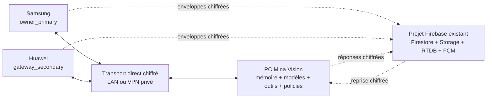

# Mina Vision — Chat natif Android local-first

**Statut :** architecture validée par Nasro le 22 juillet 2026 dans le compagnon visuel ; spécification prête pour revue avant implémentation.

**Projet concerné :** `C:\Serveurs\Mina Vision` uniquement. L’ancien projet Mina AI est explicitement hors périmètre.

## 1. Décision produit

L’APK Mina Vision devient un vrai client de conversation propriétaire sur le Samsung et le Huawei. Telegram reste un canal historique optionnel, mais n’est plus nécessaire pour converser avec Mina, recevoir ses réponses, lui envoyer des médias ou approuver les actions distantes autorisées.

Le choix retenu est **local-first avec Firebase en secours**, dans le projet Firebase déjà créé :

1. Android enregistre d’abord tout événement dans Room sous forme d’enveloppe E2EE, dans le stockage privé protégé par le chiffrement fichier Android.
2. Si le PC est joignable directement sur le LAN ou un VPN privé, l’APK utilise le transport direct chiffré pour le texte, le streaming et la voix live.
3. Sinon, l’APK dépose uniquement une enveloppe chiffrée dans Firebase.
4. Le PC reste l’unique cerveau : mémoire, modèles, outils, politiques et exécution vivent sur Mina Vision PC.
5. Si le PC est arrêté, le message reste honnêtement affiché `En attente du PC` ; aucun faux indicateur de saisie et aucune réponse simulée ne sont produits.
6. À la reconnexion, le PC produit une seule réponse finale visible, interdit tout effet dupliqué et réplique le résultat sur les deux téléphones.

Firebase transporte, réveille et synchronise. Firebase ne génère aucune réponse et ne reçoit jamais le texte, l’audio, les fichiers ni les détails d’une action en clair.

## 2. Décisions déjà validées

- Utiliser le **même projet Firebase existant**, jamais un second projet.
- Installer le chat natif sur le **Samsung et le Huawei**.
- Rôles et capacités **configurables par appareil**.
- Profil initial recommandé : Samsung `owner_primary`, Huawei `gateway_secondary`.
- Historique complet chiffré répliqué sur chaque téléphone autorisé.
- Messages texte, notes vocales, push-to-talk, photos, caméra, documents, réponses streamées, statuts, notifications et cartes d’action.
- Confirmation simple pour une action distante ordinaire.
- Biométrie ou code/verrouillage Android pour envoyer, supprimer, modifier, imprimer ou piloter la maison dans les domaines explicitement autorisés.
- Toute capacité `local_only` reste confirmable uniquement sur le PC.
- Quand le PC est arrêté, les demandes attendent ; aucun modèle cloud autonome ne remplace Mina.

## 3. État réel de départ après la réconciliation Claude

Le plan part de l’état post-réconciliation du 22 juillet 2026, et non de l’ancien audit :

- le projet possède désormais un dépôt Git **local** propre, sans remote ;
- `npm test` exécute les tests unitaires puis l’intégration ;
- le broker d’autorité `src/safety/computer-action-authorizer.mjs` est désormais la frontière obligatoire des actions Computer Use ;
- le catalogue runtime `src/runtime/capability-catalog.mjs` publie `available`, `degraded` ou `unavailable` avec une raison ;
- les domaines IPC sont composés via `src/ui/ipc/register-ipc.mjs` ;
- le Huawei Android 10/API 29 conserve la passerelle SMS/Telegram/caméra et l’ADB USB/Wi-Fi ;
- l’APK actuelle reste une passerelle/provisioning sans interface de chat Compose ;
- Firebase existe au niveau contrat et backup, mais le transport chat réel, Firestore, RTDB, FCM, App Check et les Functions ne sont pas encore branchés ;
- `ws` a été retiré comme dépendance morte et ne devra être réintroduit que dans la tâche qui livre réellement le serveur direct.

La nouvelle conception réutilise les contrôles existants au lieu de créer une seconde autorité d’action.

## 4. Compatibilité avec les spécifications précédentes

Cette spécification remplace uniquement deux hypothèses anciennes :

- le Samsung n’est plus « Telegram uniquement » : il héberge désormais l’APK Mina Vision ;
- l’approbation Samsung n’est plus limitée aux boutons Telegram : l’APK possède un adaptateur d’approbation signé et biométrique.

Elle conserve :

- le Huawei comme passerelle privilégiée SMS/Telegram/caméra ;
- la séparation entre ADB et transport métier ;
- le PC comme autorité finale ;
- le fail-closed, les digests, l’expiration et la consommation unique des confirmations ;
- Telegram comme repli optionnel sans dépendance fonctionnelle du chat natif.

## 5. Architecture cible



### Android

- `:core:protocol` : enveloppes, événements, canonicalisation, signatures et vecteurs interopérables.
- `:core:transport` : sélection direct/Firebase, files bornées, ACK, retry et backpressure.
- nouveau `:core:chat` : Room ciphertext-only, chiffrement local, outbox, synchronisation, curseurs et pièces jointes.
- nouveau `:feature:chat` : interface Compose, historique, composer, statuts et cartes d’action.
- nouveau `:feature:voice` : note vocale, push-to-talk et session live directe.
- `:app` : composition, navigation, provisioning, Firebase, notifications et services Android.
- `:feature:camera` reste séparé et réutilisé pour la capture, sans envoyer de flux caméra brut dans Firebase.

### PC

- contrat `mina_app` commun aux canaux et événements ;
- registre durable des appareils, rôles, clés et révocations ;
- serveur direct chiffré ;
- watcher Firebase, ledger idempotent et lease de génération ;
- service de conversation natif branché sur la mémoire et le routeur de modèles existants ;
- adaptateur des approbations APK vers le capability broker existant ;
- ledger SQLite contenant uniquement les enveloppes E2EE et les métadonnées techniques ; les clés restent dans le coffre chiffré existant. Le fichier SQLite lui-même n’est pas présenté comme SQLCipher ;
- publication de l’état réel dans le catalogue runtime.

### Firebase

- Firestore : événements durables chiffrés et curseurs de synchronisation ;
- Storage : chunks chiffrés des médias et snapshots d’historique ;
- Realtime Database : présence, saisie et chunks éphémères de streaming ;
- FCM : signal de réveil opaque, jamais le contenu d’un message ;
- Cloud Functions : appairage, jetons custom, révocation, FCM et garbage collection ;
- App Check : Play Integrity quand disponible, fournisseur custom pour le Huawei sans GMS/Play Integrity exploitable.

## 6. Identité, appairage et rôles

### Identités

Chaque installation possède trois éléments cryptographiques distincts :

1. `deviceId` aléatoire stable, non dérivé de l’IMEI, du numéro ou de l’adresse IP ;
2. clé ES256 Android Keystore pour signer les événements ;
3. clé maître AES-256 non exportable Android Keystore, utilisée uniquement pour protéger localement une `deviceWrapKey` aléatoire propre à cet appareil.

Le nom d’affichage choisi par Nasro est chiffré dans le registre PC par une clé metadata dédiée du keyring et n’est jamais publié en clair dans Firebase. Les règles d’autorisation utilisent seulement les ids opaques, rôle, capacités, état et versions techniques.

Le PC possède une identité `mina-brain` et ses clés restent dans le coffre/DPAPI existant. Une IP, un serial ADB, un nom de modèle ou un compte Google ne constitue jamais seul une identité Mina.

### Appairage

Le PC affiche un QR à usage unique contenant : `pairingSessionId`, challenge aléatoire 256 bits, secret de transport aléatoire 256 bits distinct, empreinte de la clé PC, endpoints privés candidats, identifiant public du projet Firebase, région Functions confirmée ou `null` tant que le cloud est inactif, et expiration de cinq minutes. Le QR est une racine de confiance physique temporaire : écran protégé, jamais journalisé et secret effacé à consommation/expiration.

L’APK :

- vérifie que le QR n’est pas expiré ;
- affiche le PC et le projet ciblés ;
- exige une validation locale Android ;
- signe le challenge avec sa clé ES256 ;
- transmet sa clé publique de signature et les capacités demandées dans une preuve chiffrée par la clé dérivée du secret QR ;
- reçoit un jeton Firebase custom lié à un UID Auth opaque propre à l’appareil, puis à `ownerId`, `deviceId` et `role` par claims ;
- reçoit une `deviceWrapKey` aléatoire dans la réponse AES-GCM de la session, la protège immédiatement sous sa clé maître Keystore, puis reçoit la clé d’époque courante enveloppée par cette `deviceWrapKey`.

Le PC valide explicitement le nouvel appareil. Aucun enrôlement silencieux n’est autorisé.

La confiance locale et le principal Firebase sont deux étapes liées mais séparées. L’appairage direct persiste d’abord l’appareil sur le PC. Si Firebase est configuré, le PC authentifié comme `mina-brain` enregistre la même session côté Function avant sa consommation ; il transmet seulement le hash du secret QR et la `deviceWrapKey` déjà chiffrée, jamais le secret QR ou la clé en clair. La Function n’accepte jamais une session créée par le téléphone. Si Firebase est indisponible, le direct reste utilisable avec l’état `cloud_pending` et Nasro doit confirmer plus tard `Activer le secours Firebase` ; le PC envoie alors un nouveau challenge sur le canal direct déjà authentifié, sans réutiliser un QR expiré.

### Rôles

| Rôle | Capacités par défaut |
|---|---|
| `owner_primary` | chat complet, historique, médias, voix, notifications, approbations ordinaires et sensibles biométriques |
| `owner_secondary` | chat complet, historique, médias, voix, approbations ordinaires ; sensibles désactivées par défaut |
| `gateway_secondary` | chat complet + capacités passerelle explicitement cochées (`gateway.sms`, `gateway.telegram`, `gateway.camera`) |
| `viewer` | lecture de l’historique et notifications, aucun envoi ni approbation |

Les capacités sont des permissions explicites, pas des conséquences implicites du rôle. Toute modification se fait localement sur le PC et incrémente `token_version`/rafraîchit les jetons. Retirer `chat.read` ou révoquer un appareil déclenche en plus une nouvelle époque ; ajouter `chat.read` exige une distribution de clé et un snapshot autorisé. Une capacité passerelle sans impact lecture ne tourne pas inutilement tout l’historique.

## 7. Authentification Firebase et App Check

- Les APK utilisent Firebase Auth avec un jeton custom émis uniquement après appairage.
- Le PC et chaque appareil possèdent un UID Firebase Auth opaque distinct, stocké dans leur document d’identité. `ownerId` reste l’identifiant logique de l’espace Mina et n’est jamais réutilisé comme UID partagé ; cette séparation rend la révocation des refresh tokens réellement ciblée par appareil.
- Les claims minimaux sont `owner_id`, `device_id`, `role` et `token_version`.
- Le PC utilise lui aussi une session Firebase liée à `device_id=mina-brain`. Le bootstrap one-shot enregistre sa clé publique ; aux démarrages suivants, une preuve ES256 sur nonce serveur émet une nouvelle session Auth/App Check. La clé privée reste dans le coffre Mina et aucun refresh token PC durable, compte de service ou secret admin n’est stocké dans `.env`, l’APK ou le renderer Electron.
- Sur Android, Firebase Auth conserve normalement l’état de session afin que la file cloud fonctionne PC arrêté. Ces credentials sont gérés uniquement par le SDK dans le stockage privé de l’application : jamais lus, copiés, journalisés ou sauvegardés par Mina ; `allowBackup=false`, révocation ciblée, `token_version`, App Check et `signOut()` lors d’une révocation limitent ce risque résiduel.
- Les secrets administratifs existent uniquement dans l’environnement managé des Cloud Functions.
- Révocation : marquer l’appareil inactif, révoquer les refresh tokens de son UID Auth dédié, désactiver ce principal, incrémenter `token_version`, supprimer son Firebase Installation ID (FID) ciblable côté serveur, appeler `unregister()` puis supprimer le FID côté appareil lorsqu’il reçoit l’ordre, et tourner la clé d’époque pour les événements futurs.
- Samsung/GMS : Play Integrity si l’application et le projet Cloud sont liés et si le profil App Check est configuré pour une distribution APK hors Google Play (`PLAY_RECOGNIZED` et `LICENSED` non requis, intégrité appareil requise). Si cette précondition n’est pas disponible, le même fournisseur custom appairé que le Huawei est utilisé et l’état reste honnêtement `software_paired`, jamais `hardware`.
- Huawei sans GMS : fournisseur App Check custom. Avant Firebase Auth, un endpoint de bootstrap accepte uniquement une session d’appairage non consommée, le challenge signé, le digest de signature APK déclaré et un nonce serveur ; il émet un jeton App Check au TTL minimal officiel de trente minutes. Sa fenêtre d’usage effective reste cinq minutes car `completePairing` revalide la session, l’expiration, le nonce et la signature ; sans Auth, les rules refusent par ailleurs toute donnée. Après Auth, le renouvellement normal exige l’ID token de l’UID appareil, une signature fraîche et la `token_version` courante. Après une longue coupure où ID token et App Check sont expirés, un mode recovery accepte seulement ownerId/deviceId, nonce serveur one-shot, signature de la clé appareil enregistrée, `token_version` live et version APK autorisée ; il émet App Check mais jamais un token Auth. Firebase Auth peut alors renouveler sa propre session avec son refresh token privé. Un appareil révoqué reste refusé. Sans attestation matérielle, le digest APK déclaré n’est qu’un signal de policy et jamais une preuve autonome : la confiance repose sur l’appairage physique et la clé Keystore, d’où l’état `software_paired`. Cette séparation évite les dépendances circulaires Auth↔App Check.
- L’exemption d’enforcement App Check est une allowlist exacte : `issueBootstrapAppCheck`, `issueBrainSession` et `issueCustomAppCheck`. Le troisième doit fonctionner quand l’ancien token et éventuellement l’ID token sont expirés ; ses deux modes exigent toujours signature appareil, nonce, `token_version` live et version APK, avec Auth valide en mode normal. Tout autre endpoint exige App Check.
- L’attestation Huawei est publiée `hardware`, `software_paired` ou `unavailable` ; l’état reste `degraded` si une garantie matérielle n’est pas démontrée.
- Les endpoints sensibles d’appairage et révocation utilisent un token App Check à usage limité avec protection anti-replay. `completePairing` revalide toujours la preuve cryptographique de la session même après App Check ; App Check ne remplace jamais l’autorisation d’appairage.

## 8. Chiffrement de bout en bout

### Clés

- Une clé de conversation AES-256 existe par `keyEpoch`.
- Le PC génère l’époque initiale et chaque rotation.
- Chaque appareil possède une `deviceWrapKey` AES-256 distincte. Le PC la conserve dans le keyring Mina sous un nom domain-separated ; Android la conserve chiffrée par sa clé maître AES non exportable Keystore.
- Les clés d’époque PC sont persistées individuellement dans le keyring et référencées par des migrations SQLite immuables ; une rotation ne remplace jamais le fichier d’une migration déjà appliquée.
- Pour distribuer une époque, le PC dérive par HKDF-SHA256 une clé de wrapping liée à `deviceId + keyEpoch`, puis chiffre la clé d’époque par AES-256-GCM avec nonce aléatoire et AAD canonique. `deviceWrapKey` et clé d’époque ne vivent en clair qu’en mémoire bornée et sont effacées après usage.
- La révocation crée une nouvelle époque ; elle ne prétend pas effacer rétroactivement les données déjà déchiffrées par l’ancien appareil.
- Les clés privées de signature et la clé maître Android ne quittent jamais Android Keystore ; la `deviceWrapKey` n’est jamais sérialisée en clair.

### Événements

- Algorithme : AES-256-GCM, nonce aléatoire 96 bits, tag 128 bits.
- Signature : ES256 sur l’en-tête canonique, le ciphertext, le nonce et le tag.
- Encodage canonique : format binaire versionné, domain-separated, longueurs UTF-8 en uint32 big-endian, entiers non signés big-endian et timestamps en epoch millisecondes. Les identifiants de protocole sont ASCII bornés ; aucune dépendance à l’ordre des clés JSON ou à la normalisation locale.
- Signature ES256 : ASN.1 DER canonique de 8 à 72 octets, encodé en base64 standard avec padding et donc borné à 96 caractères. Node force `dsaEncoding:'der'` et Android utilise le DER de `SHA256withECDSA`; les fixtures vérifient les deux directions.
- AAD : version, eventId, threadId, senderDeviceId, deviceSequence, keyEpoch, classe de routage, dates et expiration.
- `expiresAtMs` borne l’acceptation initiale/replay de l’enveloppe signée ; la durée de présence de sa copie Firebase est une lease serveur distincte `cloudExpiresAt` dans `eventRuntime`.
- Une `RenewalProof` externe ne modifie jamais l’enveloppe. Elle signe, dans un codec binaire domain-separated `MINA_EVENT_RENEWAL_V1`, `eventId`, SHA-256 des octets exacts de l’enveloppe, `senderDeviceId`, scope du destinataire, nonce 32 octets émis par le destinataire, `issuedAtMs` et nouvelle échéance demandée. La preuve expire en cinq minutes. Le nonce est consommé logiquement une seule fois : le retry byte-for-byte rend le même reçu, toute réutilisation avec un autre digest est refusée.
- Anti-replay : compteur monotone par appareil + `eventId` unique + ledger PC.
- Le plaintext structuré est validé après signature et déchiffrement, jamais avant.

### Pièces jointes

- Une clé est dérivée par HKDF-SHA256 depuis la clé d’époque et `attachmentId`.
- Fichier découpé en chunks plaintext de 4 MiB maximum, chacun avec nonce/tag/hachage indépendant ; l’objet chiffré complet reste strictement sous la limite Storage de 5 MiB.
- Le manifeste chiffré contient nom, MIME, taille, nombre de chunks, digests et miniature éventuelle.
- Aucun nom de fichier, caption, waveform ou miniature en clair dans Storage.

### Stockage local Android

Room conserve les enveloppes E2EE et métadonnées techniques minimales dans le sandbox de l’application, lui-même couvert par le chiffrement fichier Android après verrouillage. Les noms, textes, manifestes et contenus restent chiffrés au niveau Mina. Les clés d’époque enveloppées sont déchiffrées en mémoire à la demande ; elles ne sont jamais sérialisées en clair.

La première release ne prétend pas utiliser SQLCipher. Son intégration avec Room 2.8.4 possède encore un incident ouvert côté projet officiel ; l’ajouter sans gate Samsung/Huawei introduirait un risque de crash au démarrage. Une couche SQLCipher pourra être proposée ensuite, uniquement après test de compatibilité instrumenté, migration réversible et mesure de taille APK. La confidentialité du contenu ne dépend pas de ce futur durcissement : elle repose déjà sur les enveloppes E2EE, Keystore et le chiffrement fichier Android.

## 9. Contrat événementiel `mina_app`

Le canal commun devient `mina_app`. L’enveloppe v1 reste compatible ; le protocole ajoute une version v2 pour les événements du chat sans casser SMS/Telegram.

Classes routables en clair, volontairement grossières :

- `message` ;
- `receipt` ;
- `control` ;
- `stream` ;
- `approval`.

Types chiffrés :

- `message.text.created` ;
- `message.attachment.created` ;
- `message.voice.created` ;
- `message.status.changed` ;
- `assistant.response.started` ;
- `assistant.response.chunk` ;
- `assistant.response.completed` ;
- `assistant.response.failed` ;
- `approval.requested` ;
- `approval.approved` ;
- `approval.denied` ;
- `device.role.changed` ;
- `device.endpoint.changed` ;
- `device.revoked` ;
- `history.snapshot.available` ;
- `thread.created` ;
- `thread.renamed` ;
- `thread.archived` ;
- `thread.tombstoned` ;
- `thread.purged`.

Un événement est append-only. Une correction, un statut ou une suppression est un nouvel événement signé. Aucun client ne réécrit le contenu historique d’un document Firestore.

## 10. Synchronisation et états

### État d’un message sortant

```text
local_pending
→ direct_sending | cloud_queued
→ pc_received
→ processing
→ response_streaming
→ completed
```

Erreurs :

- `retry_wait` avec prochaine tentative et cause stable ;
- `failed_final` seulement après erreur non récupérable ou refus de policy ;
- `canceled` après annulation explicite ;
- `expired_remote_copy` signifie uniquement que la copie Firebase a expiré : l’outbox locale reste et passe par le protocole de renouvellement, jamais par un nouvel append ordinaire.

### Une seule réponse finale et aucun effet dupliqué

- Chaque appareil attribue dans une transaction durable un `deviceSequence` monotone et un `eventId` ULID monotone. `deviceSequence`, `canonicalSequence` et `serverSequence` restent dans `[1, 9 007 199 254 740 991]`, borne exacte interopérable avec les nombres JavaScript ; `keyEpoch` reste dans `[1, 2 147 483 647]`, borne de l’`Int` Kotlin. L’allocation s’arrête fail-closed avant qu’un compteur `next*` ne déborde cette plage. Une réinstallation perdant la clé Keystore crée obligatoirement une nouvelle identité et un nouvel appairage ; l’ancien compteur n’est jamais réutilisé sous le même `deviceId`.
- Le PC réclame l’événement dans une transaction SQLite avant génération.
- Une lease SQLite empêche deux générations concurrentes pour la même source et permet la reprise après crash.
- Le texte généré, les chunks et le résultat final sont persistés avant émission.
- Une reconnexion rejoue la livraison, jamais la génération si un résultat existe déjà.
- Les ACK sont idempotents et signés.

La garantie porte sur **une seule réponse finale visible et un seul effet métier**. Si le processus tombe après qu’un fournisseur de modèle a accepté une requête mais avant toute persistance locale, une seconde invocation du modèle peut être nécessaire au redémarrage et donc générer un coût supplémentaire. Un idempotency key provider est utilisé quand il existe ; sinon la tentative est auditée et bornée, sans prétendre garantir exactement une invocation externe.

### Historique complet

- Source canonique : PC chiffré + appareils actifs.
- Firebase est une boîte de synchronisation, pas l’archive unique.
- Room est l’unique outbox durable Android. Le cache disque Firestore, activé par défaut sur Android, est remplacé par un cache mémoire afin d’éviter deux files offline concurrentes et des états de livraison ambigus.
- Le curseur cloud est un `serverSequence` global attribué exclusivement par une Function et publié dans un `syncLog` immuable, distinct de l’index courant `eventRuntime`. Il sert au rattrapage/FCM ; il ne remplace pas la `canonicalSequence` propre à chaque conversation. `syncState/current` expose seulement `highWatermark` et `compactedThrough` : un appareil derrière le préfixe compacté demande un snapshot au lieu de traiter la compaction comme une corruption.
- Un événement reçu directement par le PC est relayé idempotemment vers le cloud par une Function brain-only afin que l’autre téléphone le voie. La Function conserve l’enveloppe signée d’origine et crée son runtime ; elle ne réécrit pas l’auteur.
- Si cet événement direct était historiquement expiré, le PC persiste d’abord la `RenewalProof` de session avec son claim ledger. Le relay brain-only doit transmettre cette preuve source exacte et une attestation PC fraîche liée à son digest ; la Function revalide les deux signatures, l’appareil encore actif et le contenu byte-for-byte, puis emprunte la même transaction de lease/`syncLog` qu’un renouvellement cloud. Sans cette preuve, le traitement local reste possible mais aucun relay historique ordinaire n’est accepté.
- Chaque copie Firebase possède une lease maximale de 30 jours et peut être supprimée plus tôt après ACK de tous les appareils actifs. Ce plafond vaut par publication : un événement encore présent dans une outbox non acquittée peut obtenir une nouvelle lease, ce que le data map doit déclarer explicitement au lieu de promettre une durée totale de 30 jours.
- Si une copie a expiré alors que l’outbox source n’a jamais reçu l’ACK PC, l’appareil actif obtient un nonce one-shot de la Function et appelle `renewExpiredEvent` avec les octets originaux et une `RenewalProof` fraîche. La Function vérifie Auth, App Check, appareil actif, signature d’origine, digest exact, scope, fenêtre de cinq minutes et anti-replay. Dans une transaction Admin, elle conserve ou recrée exactement le même `eventId`/contenu, attribue un nouveau `serverSequence` et une nouvelle lease cloud de 30 jours, puis ajoute une entrée `syncLog` immuable portant la preuve. Les consommateurs avancent leur curseur mais dédupliquent sur `eventId` : aucun second message n’apparaît. Aucun timestamp/signature d’origine n’est réécrit.
- Un appareil neuf reçoit un snapshot complet chiffré produit par le PC, direct si possible, sinon via Storage pendant sept jours. Le PC génère une clé AES snapshot aléatoire, chiffre manifeste/chunks avec elle, puis enveloppe cette petite clé avec la `deviceWrapKey` de l’appareil ; aucun secret long terme n’entre dans Storage.
- La GC ne supprime du `syncLog` qu’un préfixe contigu. Elle avance atomiquement `syncState.compactedThrough` après ACK/cursors de tous les appareils actifs, ou à l’expiration de la lease quand un client retardataire devra de toute façon passer par snapshot. Un trou au-dessus de `compactedThrough` est une corruption/reprise à réparer ; un curseur en dessous est une compaction normale, jamais un faux trou.
- Si une entrée `syncLog` non compactée référence déjà une copie événement supprimée par TTL, le client ne saute ni n’avance : il demande un snapshot. Le petit log de métadonnées peut donc survivre à la copie ciphertext jusqu’à ce que son préfixe devienne compactable, sans prolonger la rétention du contenu.
- Le manifeste porte une plage canonique par `threadId`, jamais un faux curseur global de conversation, ainsi qu’un `cloudResumeSequence` distinct correspondant au dernier `syncLog` entièrement ingéré par le PC avant le cut du snapshot. Android écrit les chunks dans des tables de staging et ne promeut le snapshot dans l’historique visible qu’après validation de tous les digests, époques et comptes ; il avance son cursor cloud vers ce resume point dans la même transaction, puis relit les entrées ultérieures.
- Le snapshot réplique tous les événements et manifestes. Les blobs médias sont ensuite repris par digest/chunk depuis le PC ou Storage ; l’UI ne marque l’historique `complet` qu’après vérification de l’inventaire, sinon elle affiche précisément le nombre de médias encore en attente.
- Une copie Firebase expirée n’efface jamais l’historique local.

## 11. Modèle Firebase

Les emplacements réels de Firestore, RTDB et Storage du projet existant sont inventoriés avant d’écrire les Functions. Une ressource absente n’est jamais créée implicitement : son provisionnement manuel dans ce même projet, sa localisation immuable et son coût exigent une confirmation distincte. La région Functions est un paramètre de déploiement obligatoire sans valeur par défaut ; elle est choisie au plus près des ressources existantes, puis incluse dans la configuration publique signée remise à chaque appareil. Le PC et Android refusent un appel callable/HTTPS si la région reçue ne correspond pas à cette configuration épinglée. Aucun fallback implicite vers `us-central1` n’est accepté.

### Firestore

```text
owners/{ownerId}/devices/{deviceId}
owners/{ownerId}/deviceRuntime/{deviceId}       # Functions uniquement : FCM/attestation/nonces
owners/{ownerId}/events/{eventId}
owners/{ownerId}/eventRuntime/{eventId}         # digest/lease/index courant, Functions uniquement
owners/{ownerId}/syncLog/{sequenceKey}          # journal immuable de références, Functions uniquement
owners/{ownerId}/syncState/current              # highWatermark/compactedThrough, lecture appareils actifs
owners/{ownerId}/ownerRuntime/sync              # compteur privé global, Functions uniquement
owners/{ownerId}/renewalChallenges/{nonceDigest} # nonce/receipt minimal, Functions uniquement
owners/{ownerId}/rejectedEvents/{eventId}        # rejet minimal privé, sans séquence
owners/{ownerId}/cursors/{deviceId}
owners/{ownerId}/attachmentAcks/{attachmentId_deviceId}
owners/{ownerId}/threads/{threadId}
owners/{ownerId}/pairingSessions/{sessionId}   # Functions uniquement
```

Un document événement contient uniquement : version, ids, classe grossière, senderDeviceId, deviceSequence, keyEpoch, timestamps, expiration, tailles, ciphertext, nonce, tag et signature.

Le contrat réseau signe `createdAtMs`/`expiresAtMs` en entiers. L’adaptateur Firestore les matérialise en `Timestamp` `createdAt`/`expiresAt` et exige un round-trip exact en millisecondes avant vérification. `eventRuntime` contient `eventId`, digest d’enveloppe, `latestServerSequence`, `serverReceivedAt`, `cloudExpiresAt`, `senderDeviceId` et `routingClass`. Chaque `syncLog/{sequenceKey}` est create-only Admin, avec clé décimale fixe sur 16 chiffres, `serverSequence`, `eventId`, `reason=initial|renewal`, `serverReceivedAt` et, pour un renouvellement, `renewalIssuedAt`, `renewalNonce`, `renewalSignature` et digest de preuve. Les clients actifs lisent runtime/log/state mais ne les écrivent jamais. La preuve est domain-separated et ne contient aucun plaintext.

Contraintes :

- document ≤ 256 KiB ;
- `payloadCiphertext` base64 ≤ 196 608 caractères pour réserver la marge des métadonnées et signatures ;
- texte utilisateur ≤ 32 KiB UTF-8 ;
- création uniquement, update/delete client interdits ;
- `senderDeviceId` doit égaler le claim `device_id` ;
- l’UID Auth doit égaler `devices/{deviceId}.authUid` et le claim `owner_id` doit égaler le segment `ownerId` ;
- appareil actif obligatoire ;
- la capacité persistée doit autoriser la classe de routage ; `message` exige `chat.write`, `receipt` exige `chat.read`, `approval` exige la capacité d’approbation et `control` exige une capacité explicite. Les événements `stream` cloud sont écrits exclusivement par `mina-brain` ; l’audio live reste direct. Un rôle/claim seul ne suffit pas ;
- date et expiration bornées ;
- champs inconnus refusés.

`createdAt` ne peut pas être dans le futur de plus de cinq minutes, `expiresAt` doit être postérieur au temps serveur et ne peut dépasser `createdAt + 30 jours`. Les Rules ne pouvant pas vérifier ES256, le trigger revalide schéma, conversion Timestamp exacte, appareil actif et signature contre la clé enregistrée avant toute séquence. Un événement invalide ne reçoit ni `eventRuntime`, ni entrée `syncLog`, ni `serverSequence`, ni FCM ; seul un rejet privé minimal et un compteur device sont écrits, puis l’enveloppe est supprimée par GC bornée après 24 heures. La transaction d’indexation réserve la séquence, crée `eventRuntime`, crée exactement une entrée `syncLog` et avance `syncState.highWatermark`; un replay du trigger retourne le même résultat sans seconde entrée.

Les clients peuvent lire les devices, `eventRuntime`, `syncLog` et `syncState` de leur propre owner s’ils sont actifs, mais jamais les modifier. `deviceRuntime`, `renewalChallenges` et `rejectedEvents` sont illisibles/inécrivables côté client afin de ne pas exposer FID FCM, attestation, compteurs de rejet, reçus ou nonces. `pairingSessions`, `ownerRuntime` et `threads` sont en écriture Admin/Functions/PC uniquement. Un cursor est écrivable seulement par le device correspondant, contient un `cloudSequence` global borné par `syncState.highWatermark` et ne peut que progresser. Si `cloudSequence < compactedThrough`, le client importe un snapshot avant de reprendre au watermark signé. Les positions canoniques par thread restent dans Room et dans le manifeste de snapshot. Un ACK de pièce jointe est écrivable uniquement par le device correspondant après vérification locale du digest. Un snapshot Storage est lisible uniquement par son `targetDeviceId`; les uploads de snapshot sont réservés à `mina-brain`.

### Storage

```text
owners/{ownerId}/chat/{threadId}/attachments/{attachmentId}/{chunkIndex}
owners/{ownerId}/history-snapshots/{snapshotId}/{chunkIndex}
```

Chaque objet est `application/octet-stream`, ≤ 5 MiB après ajout du nonce, du tag et du framing, non public et accessible seulement aux appareils actifs du propriétaire. Le PC conserve la copie canonique chiffrée des médias ; une expiration cloud n’empêche donc pas la reconstruction d’un appareil revenu après 30 jours.

### Realtime Database

```text
activeDevices/{ownerId}/{deviceId}
presence/{ownerId}/{deviceId}
streams/{ownerId}/{sessionId}/frames/{sequence}
```

Les frames RTDB sont réservées au streaming texte PC→appareil quand Firebase est le transport : seul `mina-brain` écrit, les appareils actifs lisent, le ciphertext base64 est borné à 16 384 caractères et les frames expirent après dix minutes. L’audio live ne passe jamais dans RTDB. La présence expire après 90 secondes.

`activeDevices` est un miroir d’autorisation écrit uniquement par les Functions/Admin à partir du registre Firestore ; aucun client ne peut s’activer, changer son `authUid`, son rôle ou sa `tokenVersion`. Un client actif peut seulement écrire sa propre présence bornée. Les commandes stop/pause hors direct restent des événements `control` durables ; elles ne donnent jamais au téléphone un droit d’écriture dans le stream PC.

### FCM

Payload autorisée : `type=sync`, `ownerId`, `deviceId`, `highWatermark`. Aucun message, titre de document, action ou extrait vocal.

La release utilise l’API FID actuelle : auto-init maintenu désactivé, `register()` seulement après App Check + Auth, upload self-only du FID reçu par `onRegistered()`, envoi Admin via `fid`, puis `unregister()`/`onUnregistered()` et suppression du FID à la révocation. Les registration tokens/getToken/onNewToken dépréciés ne font pas partie du nouveau chemin.

## 12. Transport direct

La première release fournit le chiffrement E2EE et l’authentification mutuelle au niveau Mina sur un réseau privé/VPN ; elle ne prétend pas fournir un certificat TLS public/WSS. Avant `ready`, seuls deviceId opaque, nonces, version et empreintes circulent ; après `ready`, événements, médias, audio et contrôles sont chiffrés/authentifiés. Un observateur du LAN peut encore voir IP, timing et tailles : le VPN reste recommandé sur un réseau non maîtrisé et cette fuite de métadonnées figure dans le threat model.

- WebSocket applicatif sur interface privée ou VPN explicitement autorisé.
- Les endpoints directs sont des IP littérales privées/ULA, jamais des hostnames résolus dynamiquement. Le PC se lie uniquement aux interfaces privées sélectionnées ; aucun bind wildcard/public.
- `ws` est réintroduit côté Node seulement lorsque le serveur est réellement utilisé ; OkHttp 5.3.0 fournit le client Android.
- Le QR d’appairage épingle l’empreinte de la clé PC.
- Challenge mutuel signé à chaque connexion.
- Dans une session directe fraîche et mutuellement authentifiée, le PC émet un nonce de renouvellement distinct par événement et n’accepte une enveloppe historiquement expirée qu’avec une `RenewalProof` liée au `sessionId` et au digest exact. Le nonce du handshake n’est jamais recyclé et le ledger déduplique toujours sur l’`eventId`; cette voie permet le retour du PC après plus de 30 jours même si Firebase est indisponible.
- Tout frame métier reste chiffré au niveau Mina ; une interception LAN ne révèle pas le contenu.
- Files séparées `control`, `message`, `media`, `live_audio`.
- Priorité : `control` > `message` > `live_audio` > `media`.
- Le média ne peut jamais affamer un ACK, un stop ou une révocation.
- Le transport direct est considéré indisponible après trois heartbeats manqués ; la file durable bascule vers Firebase sans changer d’eventId.
- Un changement DHCP/VPN est propagé dans un événement de contrôle chiffré et signé. Sans Firebase ni endpoint encore joignable, l’UI propose un QR court de rafraîchissement ; elle ne fait pas de découverte mDNS non authentifiée.

ADB n’est pas ce transport. L’ADB Huawei reste maintenance/caméra/commandes mobiles selon ses règles existantes.

## 13. Expérience Android

### Navigation

- `Conversations` : liste paginée, recherche locale, nouveau fil, renommer, archiver/restaurer, masquer par tombstone, statut PC et badge des messages en attente.
- `Chat` : historique, streaming, composer et cartes d’action.
- `Voix` : note, push-to-talk, session live, pause et arrêt.
- `Appareils` : rôle, capacités, dernière activité et attestation en lecture seule. Changement de rôle/capacités et révocation restent des opérations PC locales ; l’APK affiche « Gestion requise sur le PC » au lieu d’un contrôle trompeur.
- `Réglages` : notifications, confidentialité écran verrouillé, transport et diagnostic.
- Le provisioning Telegram/SMS existant migre dans `Réglages > Passerelle` ; il ne pollue plus l’écran principal.

Les titres et opérations de fils restent chiffrés. La recherche ne crée pas d’index plaintext : elle déchiffre par lots bornés en mémoire, est annulable et n’envoie jamais la requête à Firebase ou au modèle. Copier un message est une action locale explicite avec effacement automatique du presse-papiers après 60 secondes quand le contenu n’a pas déjà été remplacé. Le composer n’annonce aucun autofill et désactive l’apprentissage personnalisé quand l’API/IME le respecte, sans prétendre cacher le texte à un clavier tiers ou à un service d’accessibilité autorisé par Android ; cette frontière système figure dans le threat model. Un tombstone APK est réversible et ne déclenche jamais l’oubli permanent ; la purge définitive reste `critical_local_only` sur le PC, émet ensuite `thread.purged` et empêche snapshots/backups de ressusciter le fil.

### Composer

- texte multiligne ;
- photo existante ;
- capture caméra ;
- document via Storage Access Framework ;
- note vocale ;
- bouton push-to-talk ;
- envoi désactivé si rôle/capacité l’interdit ;
- état explicite direct, Firebase, attente PC ou erreur ;
- politique réseau : texte/contrôle autorisés sur réseau mesuré ; pièce jointe >10 MiB attend le Wi-Fi par défaut ou une confirmation explicite pour ce transfert.

### Confidentialité UI

- `FLAG_SECURE` activable, actif par défaut sur cartes d’approbation et vue appareil ;
- notification par défaut : « Mina a répondu », sans extrait ;
- aperçu du contenu uniquement après choix explicite et avertissement que le texte entre alors dans le système de notifications/éventuels appareils compagnons ; jamais de détail d’approbation ;
- aucun secret, digest complet ou token dans les logs Android.

## 14. Médias et documents

Bornes avant chiffrement :

- image : 25 MiB ;
- note vocale : 30 minutes ou 50 MiB ;
- document : 100 MiB ;
- total d’un message : 120 MiB.

Types initiaux : JPEG, PNG, WebP, HEIC, PDF, DOCX, XLSX, PPTX, TXT, Markdown, CSV, JSON, M4A/MP4 audio, OGG/Opus et WAV.

Exécutables, APK, scripts, MSI, JAR et archives arbitraires sont refusés dans la première release. Un document reçu est déchiffré côté PC dans la quarantaine existante puis passe par les politiques de lecture/document intake ; il reste une donnée non fiable et ne déclenche aucun outil.

Sur Android, les pièces reçues restent chiffrées au repos. Image/audio sont lus par flux borné. Ouvrir ou partager un document vers une application externe crée seulement à la demande un fichier cache privé à durée courte, exposé par `FileProvider` read-only à un package choisi ; l’UI avertit que l’application destinataire peut ensuite conserver une copie. Le cache est exclu des backups et nettoyé au timeout/démarrage suivant, sans promesse d’effacement physique des blocs flash.

## 15. Notifications Samsung et Huawei

FCM et Analytics restent en auto-initialisation désactivée dans le manifest. Après une policy cloud signée, l’app installe d’abord le provider App Check choisi, établit la session Auth dédiée, puis seulement enregistre explicitement FCM. Révocation/reset désactive l’auto-init avant `unregister` et `signOut`, afin qu’un redémarrage ne recrée pas silencieusement un token.

Sur Android 13+, `POST_NOTIFICATIONS` est demandé dans une UI visible après appairage et explication, jamais au premier boot. Un refus laisse le chat, Room, le direct et la synchronisation FCM data-only fonctionnels ; l’état `notifications_refusees` est affiché sans relance insistante. Android 10–12 ne reçoit pas de faux prompt runtime.

### Samsung avec GMS

- FCM réveille l’application ;
- pour une APK sideloadée, Play Integrity utilise le profil hors Google Play prévu par Firebase ; si le prérequis Play Console/Cloud n’est pas disponible, le fournisseur custom appairé est utilisé avec état dégradé explicite ;
- WorkManager exécute la synchronisation durable ;
- `onMessageReceived` ne réalise aucune longue opération ;
- perte de messages FCM déclenche un resync complet depuis le curseur durable.

### Huawei Android 10

- si GMS/FCM est réellement disponible, même chemin que Samsung ;
- sinon, le service foreground Mina Gateway déjà présent maintient le listener chiffré quand Nasro l’active ;
- WorkManager fournit un rattrapage périodique ;
- le périodique Android n’est pas présenté comme temps réel : sa cadence minimale est de quinze minutes et le constructeur peut la retarder ;
- l’UI affiche honnêtement `notifications_temps_reel_degradees` si les restrictions Huawei empêchent le listener ;
- aucune dépendance à un second projet Huawei/AppGallery n’est introduite dans cette conception.

## 16. Approbations et actions

Le modèle ou un message ne devient jamais une autorité. Le flux est :

```text
proposition du modèle
→ normalisation existante
→ computer-action-authorizer / capability broker
→ ApprovalRequest signé par le PC
→ vérification APK de la signature PC et du digest
→ carte APK
→ confirmation simple ou BiometricPrompt
→ signature du digest exact par la clé Android
→ revalidation PC de l’état et de la policy
→ consommation unique
→ exécution
→ vérification de l’effet
```

### Niveaux

| Niveau | APK |
|---|---|
| `read_only` | autorisable selon capacité sans confirmation supplémentaire |
| `ordinary_remote` | bouton confirmer/refuser |
| `sensitive_remote` | biométrie forte ou credential Android + signature auth-per-use |
| `critical_local_only` | carte informative seulement ; confirmation impossible hors PC |

`sensitive_remote` couvre notamment envoi, suppression, modification, impression et maison connectée autorisée. Paiement, secrets, comptes/MFA, sécurité, signature légale, suppression définitive, sandbox write/execute et capacités marquées `local_only` restent sur le PC.

La demande expire au plus tard après cinq minutes, lie capability, ressource, action, état observé, effet attendu, données divulguées et nonce. La décision, la méthode d’authentification réelle et l’horodatage sont eux-mêmes couverts par la signature appareil. Toute différence invalide la confirmation.

Une carte est ciblée vers un seul appareil possédant la capacité attendue. Son événement de routage reste une enveloppe E2EE de conversation, mais les détails (`ressource`, destinataire, état, effet, données divulguées) sont dans une seconde enveloppe AES-GCM dérivée de la `deviceWrapKey` du destinataire et de `approvalId`. Un `viewer` ou l’autre téléphone ne peut donc pas lire les détails d’une action qu’il n’est pas autorisé à décider. Proposer la même action à plusieurs appareils exige une enveloppe ciblée distincte par appareil et une consommation globale first-wins côté PC.

## 17. Voix

### Notes vocales

- AudioRecord PCM16 mono 16 kHz au premier plan, avec contrôle de buffer ;
- chiffrement de chaque chunk directement vers l’AttachmentStore, sans fichier audio plaintext temporaire ;
- reconstruction/transcodage éventuel uniquement sur le PC après vérification ;
- transcription et réponse seulement sur le PC ;
- file locale si PC arrêté.

### Push-to-talk

Le bouton enregistre pendant l’appui puis envoie une note courte. Il fonctionne sur Firebase et n’exige pas une session live.

### Live

- nécessite PC en ligne et transport direct LAN/VPN ;
- audio PCM16 mono 16 kHz en frames chiffrées et séquencées ;
- le PC bridge vers le moteur vocal Mina existant ;
- retour audio PCM chiffré ;
- `pause`, `reprendre`, `arrêter` et barge-in sont des frames `control` prioritaires ;
- perte directe termine proprement le live et propose d’envoyer la capture restante comme note vocale.

Le transcript signé d’ouverture contient session/thread, deux nonces, époque, paramètres audio et quatre préfixes de nonce. HKDF-SHA-256 dérive quatre sous-clés indépendantes : audio et contrôle, dans chaque direction. Chaque nonce GCM vaut préfixe 32 bits + compteur 64 bits monotone propre à sa sous-clé ; un compteur/préfixe réutilisé ferme la session. Ainsi une collision inter-direction ou audio/contrôle ne réutilise jamais une même paire clé+nonce.

La conversation live à travers Internet sans VPN n’est pas promise par Firebase : elle nécessiterait WebRTC + TURN, infrastructure séparée. Cette extension reste hors première release afin de ne pas créer un faux temps réel coûteux via Firestore/RTDB.

## 18. Intégration mémoire et modèles

- `mina_app` devient un canal explicite dans les contrats Node et Android.
- Les tours owner et Mina sont mémorisés avec `threadId`, `eventId`, `deviceId`, rôle, date et provenance.
- La mémoire reste locale et chiffrée ; Firebase n’est pas une mémoire sémantique.
- Un message est traité comme donnée non fiable ; son texte ne peut pas accorder un outil.
- La génération native réutilise le routeur/fallback de modèles existant au lieu de copier le chemin Telegram.
- Le chiffrement couvre transports et stockage Mina/Firebase ; après déchiffrement sur le PC, le contenu envoyé au modèle/STT suit exactement les fournisseurs, consentements, redactions et politiques déjà configurés dans Mina. Le chat natif n’ajoute aucun fournisseur ni transfert caché, et le data map nomme les destinataires réellement activés.
- Le résultat passe par le response gate avant livraison.
- Les actions structurées passent par l’autorité existante, jamais par une commande libre contenue dans le chat.

## 19. Défaillances et reprise

- PC arrêté : outbox locale + Firebase ; statut `En attente du PC`.
- Firebase indisponible : conservation locale et retry exponentiel borné.
- Direct perdu : même eventId réémis par Firebase.
- ACK perdu : redelivery puis déduplication, sans régénération.
- Appareil révoqué : lecture/écriture refusée, refresh tokens de son principal Auth dédié révoqués, principal désactivé, nouvelle époque.
- Époque inconnue : demande de clé enveloppée ; aucun fallback plaintext.
- Pièce jointe incomplète : aucun déchiffrement métier ; reprise par chunk.
- FCM perdu : WorkManager/resync par curseur.
- base locale verrouillée : chat visible comme verrouillé, aucun contenu déchiffré.
- mémoire PC verrouillée : messages reçus mais non traités ; état `Mina verrouillée`.
- arrêt d’urgence PC : streams, générations et actions annulés ; aucun nouvel effet ne démarre.
- réinstallation/effacement de données Android : les clés Keystore et la session sont considérées perdues, l’installation crée un nouveau `deviceId` et exige un nouvel appairage ; aucune restauration silencieuse d’une base devenue indéchiffrable.
- téléphone perdu hors ligne : la révocation et la rotation empêchent les accès futurs, mais Mina ne prétend pas effacer à distance des données déjà présentes tant que l’appareil ne se reconnecte pas ou qu’un mécanisme système/MDM ne l’efface pas.

## 20. Budgets et limites

- outbox Android : 5 000 événements ou 500 MiB ; au-delà, média refusé mais texte/contrôle conservés dans une réserve dédiée ;
- téléchargement média : conserver une réserve disque de 256 MiB et ne jamais émettre d’ACK si le fsync local n’a pas réussi ; manque d’espace donne `medias_en_attente`, sans éviction silencieuse de l’historique ;
- file PC : 10 000 événements, priorité contrôle ;
- Firestore : 256 KiB par événement ;
- RTDB texte : ciphertext base64 ≤ 16 384 caractères par frame, TTL dix minutes ; aucun audio live ;
- stream texte distant : chunks regroupés toutes les 350 ms au minimum ;
- Functions v2 : aucune min instance, maximum global 3, concurrence 20, timeout 30 s ; GC/compaction maximum 1 et timeout 120 s ;
- heartbeat direct : 10 secondes, indisponible après 30 secondes ;
- retry : 5 s, 15 s, 1 min, 5 min, 15 min, puis toutes les heures ;
- pairing et approbation : cinq minutes ;
- lease d’une copie d’événement cloud : 30 jours par publication/renouvellement tant que l’outbox source n’est pas acquittée ; snapshot bootstrap : sept jours ;
- upload orphelin sans manifeste : 24 heures ; pairing session, nonce et HMAC de rate-limit : suppression à leur expiry/TTL court ;
- logs : métadonnées redacted, jamais de texte/audio/fichier.

Ces valeurs doivent rejoindre le catalogue de budgets opérationnels au lieu d’être dupliquées dans plusieurs composants. Aucun nouveau stockage analytics/télémétrique durable n’est créé. Un data map versionné inventorie contenu E2EE, métadonnées, tokens, attestation, présence, HMAC IP, logs et caches avec finalité, lecteurs, rétention, export et effacement ; un audit RGPD relit cette carte et le diff final avant release.

## 21. Tests obligatoires

### Contrats

- mêmes fixtures Node/Kotlin pour encodage binaire exact, DER ES256, AES-GCM, ULID monotone, counters, expiry et keyEpoch ;
- inconnus, champs supplémentaires, nonce/tag invalides et replay refusés ;
- aucune propriété plaintext acceptée par les backends Firebase.

### Android

- Room, migrations, Keystore, rotation et verrouillage ;
- ViewModel, UI Compose, accessibilité, grandes polices et rotation écran ;
- WorkManager, FCM, foreground Huawei et réseau partitionné ;
- fichiers partiels, reprise, taille/MIME, espace disque ;
- biométrie acceptée/refusée/lockout/credential ;
- vrai Samsung et vrai Huawei Android 10.

### PC

- migrations SQLite immuables, lease de génération et une seule réponse/effet visible ;
- multi-device et rôles ;
- transport direct/Firebase, failover et backpressure ;
- mémoire et response gate ;
- approbation digest/state/policy/replay ;
- arrêt d’urgence pendant génération, média, live et action.

### Firebase Emulator Suite

- Firestore, RTDB, Storage, Auth et Functions, y compris attribution idempotente de `serverSequence` ;
- owner différent, UID Auth d’un autre appareil, device claim absent, device révoqué, champ inconnu, taille/TTL dépassés ;
- impossible de modifier/supprimer un événement client ;
- expiration simulée au-delà de 30 jours, renouvellement exact avec nouveau `serverSequence`, nonce rejoué/tampering refusés et un seul message logique ;
- FCM mock : signal opaque seulement ;
- garbage collection après ACK de tous les appareils.

## 22. Déploiement progressif

1. Contrats et constitution, sans réseau réel.
2. Texte direct Samsung ↔ PC sur LAN.
3. Texte Huawei + rôles multi-device.
4. Firebase Emulator Suite.
5. Même projet Firebase en environnement réel avec App Check non enforced, observation des métriques.
6. Enforce rules/Auth, puis App Check Samsung en profil sideload ou fournisseur custom dégradé selon le prérequis Play Integrity réellement vérifié.
7. App Check custom et fallback foreground Huawei.
8. Historique complet et pièces jointes.
9. Approbations biométriques.
10. Notes vocales/PTT.
11. Live LAN/VPN.
12. Gate release complet et rollback APK précédent conservé.

Chaque étape est réversible et ne retire pas Telegram avant validation complète du chat natif.

## 23. Gate constitutionnel obligatoire

`MINA.md` ne définit pas encore le canal `mina_app`. Le code ne doit pas rendre ce canal actif avant validation explicite par Nasro d’un amendement constitutionnel séparé.

Proposition exacte à soumettre, sans l’appliquer automatiquement :

```markdown
- Application Mina (`mina_app`) : conversation, mémoire et médias uniquement depuis un appareil appairé, actif et autorisé. Les approbations distantes sont liées au digest exact, expirantes et consommables une fois ; une action sensible exige une authentification Android et une signature de clé appareil. Toute capacité `local_only` reste confirmable exclusivement sur le PC.
```

Cette ligne compléterait la section `## Canaux`. Toute modification supplémentaire de `MINA.md` exige sa propre proposition.

## 24. Critères d’acceptation produit

1. Samsung et Huawei conversent avec Mina sans Telegram.
2. Un message envoyé PC arrêté reste durable, y compris après une expiration cloud simulée supérieure à 30 jours, et produit une seule réponse finale visible et aucun effet dupliqué au retour.
3. Les deux appareils retrouvent le même historique complet chiffré.
4. Firebase ne contient aucun texte, nom de fichier, miniature, audio ou détail d’action lisible.
5. Direct est prioritaire ; Firebase reprend automatiquement sans doublon.
6. Un appareil révoqué ne peut plus lire, écrire, streamer ou approuver.
7. Une confirmation sensible exige Android biométrique/credential et signe le digest exact.
8. Une capacité `local_only` est techniquement impossible à approuver depuis l’APK.
9. Notes vocales et PTT fonctionnent partout ; live fonctionne quand le PC est joignable directement.
10. Huawei fonctionne sans dépendre obligatoirement de FCM/GMS, avec dégradation visible si le temps réel background n’est pas garanti.
11. Tous les tests Node, intégration, Android, Emulator Suite et appareils physiques passent.
12. Telegram peut être désactivé sans casser le chat natif.

## 25. Hors périmètre de la première release

- modèle IA hébergé dans Firebase ;
- plaintext cloud ;
- chat de groupe ou autre propriétaire ;
- accès invité externe ;
- appels audio/vidéo entre humains ;
- live Internet garanti sans VPN/TURN ;
- envoi d’exécutables ou archives arbitraires ;
- modification automatique de `MINA.md` ;
- suppression immédiate de Telegram avant recette.
- chiffrement transparent du fichier Room par SQLCipher tant que la compatibilité Room 2.8.4 n’est pas démontrée sur les deux appareils ; le contenu Room reste néanmoins E2EE dès la première release.

## 26. Références officielles

- Firebase Android BoM 34.16.0 et Google Services 4.5.0 : https://firebase.google.com/docs/android/setup
- Environnements Firebase JS supportés, dont Node.js 18+ avec App Check custom : https://firebase.google.com/docs/web/environments-js-sdk
- Persistance Firestore Android : https://firebase.google.com/docs/firestore/manage-data/enable-offline
- Réception FCM et délégation des travaux longs à WorkManager : https://firebase.google.com/docs/cloud-messaging/android/receive-messages
- Initialisation/registration FCM explicite : https://firebase.google.com/docs/cloud-messaging/android/get-started et https://firebase.google.com/docs/reference/android/com/google/firebase/messaging/FirebaseMessaging
- Ciblage FCM actuel par Firebase Installation ID (`fid`) : https://firebase.google.com/docs/cloud-messaging/send/admin-sdk et https://firebase.google.com/docs/cloud-messaging/manage-tokens
- Permission runtime de notification Android 13+ : https://developer.android.com/develop/ui/compose/notifications/notification-permission
- Protection Android contre le tapjacking/overlays : https://developer.android.com/privacy-and-security/risks/tapjacking
- App Check Play Integrity : https://firebase.google.com/docs/app-check/android/play-integrity-provider
- Persistance de la session Firebase Auth Android : https://firebase.google.com/docs/auth/users
- Fournisseur App Check custom : https://firebase.google.com/docs/app-check/custom-provider
- Installation du provider App Check custom avant les autres SDK Android : https://firebase.google.com/docs/app-check/android/custom-provider
- Protection anti-replay App Check : https://firebase.google.com/docs/app-check/custom-resource-backend
- Régions Cloud Functions et proximité avec les ressources Firebase : https://firebase.google.com/docs/functions/locations
- Paramètres Firebase disponibles au déploiement pour les options runtime : https://firebase.google.com/docs/functions/config-env
- Authentification biométrique Android : https://developer.android.com/identity/sign-in/biometric-auth
- Compose BOM 2026.06.00 : https://developer.android.com/develop/ui/compose/bom
- WorkManager 2.11.2 : https://developer.android.com/jetpack/androidx/releases/work
- AudioRecord : https://developer.android.com/reference/android/media/AudioRecord
- OkHttp 5.3.0 : https://github.com/square/okhttp
- Complexités OAEP Android Keystore/MGF1 ayant motivé le wrapping AES interopérable : https://developer.android.com/privacy-and-security/cryptography#oaep-mgf1-message-digest
- SQLCipher Android et incident Room 2.8.4 à lever avant intégration : https://github.com/sqlcipher/sqlcipher-android et https://github.com/sqlcipher/sqlcipher-android/issues/81
